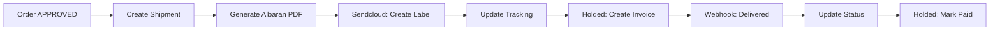

# 📦 FASE 4: SISTEMA LOGÍSTICO COMPLETO

**Fecha:** 15/01/2025  
**Duración Estimada:** 3-4 días  
**Prioridad:** CRÍTICA 🔥  
**Estado:** PLANIFICACIÓN

---

## 🎯 CONTEXTO Y JUSTIFICACIÓN

### Por qué es crítica:
1. **Cierra el ciclo comercial** - De pedido → envío → factura → cobro
2. **Elimina trabajo manual** - Albaranes PDF automáticos, tracking centralizado
3. **Integra finanzas** - Holded sync automático (facturas, pagos)
4. **Mejora experiencia cliente** - Tracking en tiempo real vía Sendcloud
5. **Compliance fiscal** - Albaranes firmados digitalmente, trazabilidad completa

### Dependencias:
- ✅ **Fase 1** (Pedidos) - Necesita orders.status === 'APPROVED' para crear shipment
- ✅ **SSOT** - Shipment ya existe en schema
- ✅ **Firebase Admin** - Para generar PDFs server-side

### Estado Actual:
```typescript
// ✅ YA TENEMOS:
- Shipment entity en SSOT
- ShipmentStatus enum ('pending' | 'shipped' | 'delivered')
- Basic CRUD en Firebase

// ❌ FALTA:
- PDF generation (albaranes)
- Holded integration (facturas, sync)
- Sendcloud integration (envíos, tracking)
- Webhooks para tracking updates
- UI mejorada de logistics
```

---

## 🏗️ ARQUITECTURA TÉCNICA

### Sistema de Integraciones (Middleware Común)

Todas las integraciones externas siguen el mismo patrón:

```typescript
// src/server/integrations/base-integration.ts
export abstract class BaseIntegration {
  protected apiKey: string;
  protected baseUrl: string;
  protected useMock: boolean;

  abstract async call(endpoint: string, data?: any): Promise<any>;
  abstract async handleWebhook(payload: any): Promise<void>;
  
  protected async logCall(endpoint: string, success: boolean): Promise<void>;
}
```

**Ventajas:**
- ✅ Mock mode por defecto (desarrollo sin APIs)
- ✅ Feature flags para activar modo real
- ✅ Logs centralizados de todas las llamadas
- ✅ Retry logic automático
- ✅ Rate limiting built-in

### Flujo de Datos



### Stack Tecnológico

1. **PDF Generation:**
   - `@react-pdf/renderer` - React components → PDF
   - Server-side rendering (Firebase Functions)
   - Storage en Firebase Storage

2. **Holded Integration:**
   - REST API oficial
   - OAuth 2.0 (futuro)
   - Mock mode por defecto

3. **Sendcloud Integration:**
   - REST API oficial
   - Webhooks para tracking
   - Mock mode por defecto

4. **Feature Flags:**
   ```typescript
   const FEATURE_FLAGS = {
     USE_REAL_HOLDED: false,
     USE_REAL_SENDCLOUD: false,
     AUTO_CREATE_SHIPMENT: true,
     AUTO_GENERATE_ALBARAN: true
   };
   ```

---

## 📅 PLAN DE IMPLEMENTACIÓN

### **DÍA 1: Middleware + Albaranes** (8h)

#### 1.1 Base Integration Layer (2h)
```typescript
// src/server/integrations/base-integration.ts
export abstract class BaseIntegration {
  protected apiKey: string;
  protected baseUrl: string;
  protected useMock: boolean;
  protected retryAttempts = 3;
  
  constructor(config: IntegrationConfig) {
    this.apiKey = config.apiKey;
    this.baseUrl = config.baseUrl;
    this.useMock = config.useMock ?? true; // Mock por defecto
  }

  protected async call<T>(
    endpoint: string, 
    method: 'GET' | 'POST' | 'PUT' | 'DELETE',
    data?: any
  ): Promise<ApiResponse<T>> {
    if (this.useMock) {
      return this.mockCall(endpoint, method, data);
    }
    
    // Real API call with retry logic
    for (let attempt = 1; attempt <= this.retryAttempts; attempt++) {
      try {
        const response = await fetch(`${this.baseUrl}${endpoint}`, {
          method,
          headers: {
            'Authorization': `Bearer ${this.apiKey}`,
            'Content-Type': 'application/json'
          },
          body: data ? JSON.stringify(data) : undefined
        });
        
        await this.logCall(endpoint, response.ok);
        return await response.json();
      } catch (error) {
        if (attempt === this.retryAttempts) throw error;
        await this.wait(1000 * attempt); // Exponential backoff
      }
    }
  }

  protected abstract mockCall(endpoint: string, method: string, data?: any): Promise<any>;
  
  private async logCall(endpoint: string, success: boolean): Promise<void> {
    await db.collection('integration_logs').add({
      provider: this.constructor.name,
      endpoint,
      success,
      timestamp: new Date().toISOString(),
      usedMock: this.useMock
    });
  }
}
```

#### 1.2 Albaran PDF System (4h)
```typescript
// src/server/pdf/albaran-generator.ts
import { Document, Page, Text, View, StyleSheet } from '@react-pdf/renderer';

export async function generateAlbaranPDF(shipment: Shipment): Promise<string> {
  const order = await getOrder(shipment.orderId);
  const account = await getAccount(order.accountId);
  
  const doc = (
    <Document>
      <Page size="A4" style={styles.page}>
        {/* Header */}
        <View style={styles.header}>
          <Text style={styles.title}>ALBARÁN DE ENTREGA</Text>
          <Text>Nº {shipment.shipmentNumber}</Text>
          <Text>Fecha: {format(new Date(shipment.createdAt), 'dd/MM/yyyy')}</Text>
        </View>

        {/* Company Info */}
        <View style={styles.section}>
          <Text style={styles.label}>REMITENTE:</Text>
          <Text>Santa Brisa S.L.</Text>
          <Text>CIF: B12345678</Text>
          <Text>C/ Example 123, 28001 Madrid</Text>
        </View>

        {/* Customer Info */}
        <View style={styles.section}>
          <Text style={styles.label}>DESTINATARIO:</Text>
          <Text>{account.name}</Text>
          <Text>{shipment.addressLine1}</Text>
          <Text>{shipment.city}, {shipment.postalCode}</Text>
        </View>

        {/* Items Table */}
        <View style={styles.table}>
          <View style={styles.tableHeader}>
            <Text style={styles.tableCell}>Producto</Text>
            <Text style={styles.tableCell}>Lote</Text>
            <Text style={styles.tableCell}>Cantidad</Text>
            <Text style={styles.tableCell}>UOM</Text>
          </View>
          {shipment.lines.map((line, idx) => (
            <View key={idx} style={styles.tableRow}>
              <Text style={styles.tableCell}>{line.name}</Text>
              <Text style={styles.tableCell}>{line.lotNumber || 'N/A'}</Text>
              <Text style={styles.tableCell}>{line.qty}</Text>
              <Text style={styles.tableCell}>{line.uom}</Text>
            </View>
          ))}
        </View>

        {/* Footer */}
        <View style={styles.footer}>
          <Text>Firma del receptor:</Text>
          <View style={styles.signatureLine} />
        </View>
      </Page>
    </Document>
  );

  // Render to buffer
  const buffer = await pdf(doc).toBuffer();
  
  // Upload to Firebase Storage
  const filename = `albaranes/${shipment.id}.pdf`;
  await uploadToStorage(filename, buffer);
  
  return `gs://santa-brisa-erp.appspot.com/${filename}`;
}
```

#### 1.3 Server Action: generateAlbaran (1h)
```typescript
// src/server/actions/logistics.ts
export async function generateAlbaran(shipmentId: string): Promise<{
  success: boolean;
  pdfUrl?: string;
  error?: string;
}> {
  try {
    const shipment = await getShipment(shipmentId);
    if (!shipment) throw new Error('Shipment not found');
    
    // Generate PDF
    const pdfUrl = await generateAlbaranPDF(shipment);
    
    // Update shipment with PDF URL
    await db.collection('shipments').doc(shipmentId).update({
      deliveryNoteUrl: pdfUrl,
      deliveryNoteGeneratedAt: new Date().toISOString()
    });
    
    return { success: true, pdfUrl };
  } catch (error) {
    console.error('[generateAlbaran] Error:', error);
    return { 
      success: false, 
      error: error instanceof Error ? error.message : 'Unknown error' 
    };
  }
}
```

#### 1.4 Testing + Commit (1h)
```bash
# Test PDF generation
npm run test:pdf

# Commit
git add .
git commit -m "feat(logistics): Day 1 - Base integration + Albaran PDF system

- BaseIntegration abstract class
- Mock/Real mode switching
- Albaran PDF generator with @react-pdf/renderer
- generateAlbaran() server action
- Integration logs collection
- 400+ lines"
```

---

### **DÍA 2: Holded Integration** (8h)

#### 2.1 Holded Client + Mock (3h)
```typescript
// src/server/integrations/holded/client.ts
export class HoldedClient extends BaseIntegration {
  constructor() {
    super({
      apiKey: process.env.HOLDED_API_KEY || 'mock',
      baseUrl: 'https://api.holded.com/api',
      useMock: !process.env.HOLDED_API_KEY
    });
  }

  async createInvoice(shipment: Shipment): Promise<HoldedInvoice> {
    const order = await getOrder(shipment.orderId);
    
    return this.call('/invoicing/v1/documents', 'POST', {
      type: 'invoice',
      contactId: order.external?.holdedContactId,
      date: new Date().toISOString(),
      items: shipment.lines.map(line => ({
        name: line.name,
        units: line.qty,
        price: line.priceUnit || 0,
        tax: 21 // IVA 21%
      }))
    });
  }

  async markInvoiceAsPaid(invoiceId: string): Promise<void> {
    return this.call(`/invoicing/v1/documents/${invoiceId}/payments`, 'POST', {
      date: new Date().toISOString(),
      amount: 'total',
      paymentMethod: 'transfer'
    });
  }

  protected mockCall(endpoint: string, method: string, data?: any): Promise<any> {
    console.log('[Holded MOCK]', method, endpoint, data);
    
    if (endpoint.includes('/documents') && method === 'POST') {
      return Promise.resolve({
        id: `MOCK-INV-${Date.now()}`,
        docNumber: `FAC-${Math.floor(Math.random() * 10000)}`,
        status: 'pending',
        total: data.items.reduce((sum, i) => sum + i.units * i.price, 0)
      });
    }
    
    return Promise.resolve({ success: true });
  }
}
```

#### 2.2 Holded Sync Server Action (2h)
```typescript
// src/server/actions/holded-sync.ts
const holdedClient = new HoldedClient();

export async function syncShipmentToHolded(shipmentId: string): Promise<{
  success: boolean;
  invoiceId?: string;
  error?: string;
}> {
  try {
    const shipment = await getShipment(shipmentId);
    if (!shipment) throw new Error('Shipment not found');
    
    // Check if already synced
    if (shipment.holdedInvoiceId) {
      return { 
        success: true, 
        invoiceId: shipment.holdedInvoiceId 
      };
    }
    
    // Create invoice in Holded
    const invoice = await holdedClient.createInvoice(shipment);
    
    // Update shipment
    await db.collection('shipments').doc(shipmentId).update({
      holdedInvoiceId: invoice.id,
      holdedInvoiceNumber: invoice.docNumber,
      holdedSyncedAt: new Date().toISOString()
    });
    
    // Create FinanceLink for tracking
    await db.collection('financeLinks').add({
      docType: 'invoice',
      externalId: invoice.id,
      status: 'pending',
      docNumber: invoice.docNumber,
      netAmount: invoice.total / 1.21,
      taxAmount: invoice.total - (invoice.total / 1.21),
      grossAmount: invoice.total,
      currency: 'EUR',
      issueDate: new Date().toISOString(),
      dueDate: addDays(new Date(), 30).toISOString(),
      partyId: shipment.partyId
    });
    
    return { success: true, invoiceId: invoice.id };
  } catch (error) {
    console.error('[syncShipmentToHolded] Error:', error);
    return { 
      success: false, 
      error: error instanceof Error ? error.message : 'Unknown error' 
    };
  }
}
```

#### 2.3 Webhook Holded (2h)
```typescript
// src/app/api/webhooks/holded/route.ts
export async function POST(req: Request) {
  try {
    const payload = await req.json();
    const signature = req.headers.get('X-Holded-Signature');
    
    // Verify signature (production)
    if (process.env.HOLDED_WEBHOOK_SECRET) {
      const isValid = verifyHoldedSignature(payload, signature);
      if (!isValid) {
        return new Response('Invalid signature', { status: 401 });
      }
    }
    
    // Handle event
    switch (payload.event) {
      case 'invoice.paid':
        await handleInvoicePaid(payload.data);
        break;
      case 'invoice.cancelled':
        await handleInvoiceCancelled(payload.data);
        break;
      default:
        console.log('[Holded Webhook] Unknown event:', payload.event);
    }
    
    return new Response('OK', { status: 200 });
  } catch (error) {
    console.error('[Holded Webhook] Error:', error);
    return new Response('Error', { status: 500 });
  }
}

async function handleInvoicePaid(data: any) {
  // Find financeLink
  const link = await db.collection('financeLinks')
    .where('externalId', '==', data.id)
    .get();
  
  if (link.empty) return;
  
  // Update status
  await link.docs[0].ref.update({
    status: 'paid',
    paidAt: new Date().toISOString()
  });
  
  // Create PaymentLink
  await db.collection('paymentLinks').add({
    financeLinkId: link.docs[0].id,
    externalId: data.paymentId,
    amount: data.amount,
    date: data.paidAt,
    method: data.paymentMethod
  });
}
```

#### 2.4 Testing + Commit (1h)
```bash
# Test Holded integration
npm run test:holded

# Commit
git add .
git commit -m "feat(logistics): Day 2 - Holded integration complete

- HoldedClient with mock/real mode
- syncShipmentToHolded() server action
- Webhook handler for invoice.paid
- FinanceLink + PaymentLink tracking
- 350+ lines"
```

---

### **DÍA 3: Sendcloud Integration** (8h)

#### 3.1 Sendcloud Client + Mock (3h)
```typescript
// src/server/integrations/sendcloud/client.ts
export class SendcloudClient extends BaseIntegration {
  constructor() {
    super({
      apiKey: process.env.SENDCLOUD_API_KEY || 'mock',
      baseUrl: 'https://panel.sendcloud.sc/api/v2',
      useMock: !process.env.SENDCLOUD_API_KEY
    });
  }

  async createShipment(shipment: Shipment): Promise<SendcloudParcel> {
    return this.call('/parcels', 'POST', {
      name: shipment.customerName,
      address: shipment.addressLine1,
      address_2: shipment.addressLine2,
      city: shipment.city,
      postal_code: shipment.postalCode,
      country: shipment.country,
      weight: (shipment.weightKg || 1) * 1000, // kg → grams
      order_number: shipment.shipmentNumber,
      shipment_uuid: shipment.id,
      shipping_method: shipment.mode === 'PALLET' ? 3 : 1 // Pallet vs Parcel
    });
  }

  async getLabel(parcelId: string): Promise<{ label: string; trackingUrl: string }> {
    const response = await this.call(`/parcels/${parcelId}`, 'GET');
    return {
      label: response.label.label_printer,
      trackingUrl: response.tracking_url
    };
  }

  async cancelShipment(parcelId: string): Promise<void> {
    return this.call(`/parcels/${parcelId}/cancel`, 'POST', {});
  }

  protected mockCall(endpoint: string, method: string, data?: any): Promise<any> {
    console.log('[Sendcloud MOCK]', method, endpoint, data);
    
    if (endpoint === '/parcels' && method === 'POST') {
      const mockParcelId = Math.floor(Math.random() * 1000000);
      return Promise.resolve({
        id: mockParcelId,
        tracking_number: `3SMOCK${mockParcelId}`,
        tracking_url: `https://tracking.sendcloud.sc/3SMOCK${mockParcelId}`,
        label: {
          label_printer: `data:application/pdf;base64,MOCK_LABEL_${mockParcelId}`
        },
        status: { id: 1, message: 'Ready to send' }
      });
    }
    
    return Promise.resolve({ success: true });
  }
}
```

#### 3.2 Sendcloud Sync Server Action (2h)
```typescript
// src/server/actions/sendcloud.ts
const sendcloudClient = new SendcloudClient();

export async function createSendcloudShipment(shipmentId: string): Promise<{
  success: boolean;
  trackingNumber?: string;
  labelUrl?: string;
  error?: string;
}> {
  try {
    const shipment = await getShipment(shipmentId);
    if (!shipment) throw new Error('Shipment not found');
    
    // Check if already created
    if (shipment.trackingCode) {
      return {
        success: true,
        trackingNumber: shipment.trackingCode,
        labelUrl: shipment.labelUrl
      };
    }
    
    // Create in Sendcloud
    const parcel = await sendcloudClient.createShipment(shipment);
    const label = await sendcloudClient.getLabel(parcel.id);
    
    // Update shipment
    await db.collection('shipments').doc(shipmentId).update({
      trackingCode: parcel.tracking_number,
      trackingUrl: parcel.tracking_url,
      labelUrl: label.label,
      carrier: 'Sendcloud',
      sendcloudParcelId: parcel.id,
      status: 'ready_to_ship',
      updatedAt: new Date().toISOString()
    });
    
    return {
      success: true,
      trackingNumber: parcel.tracking_number,
      labelUrl: label.label
    };
  } catch (error) {
    console.error('[createSendcloudShipment] Error:', error);
    return {
      success: false,
      error: error instanceof Error ? error.message : 'Unknown error'
    };
  }
}
```

#### 3.3 Webhook Sendcloud (2h)
```typescript
// src/app/api/webhooks/sendcloud/route.ts
export async function POST(req: Request) {
  try {
    const payload = await req.json();
    
    // Verify signature
    const signature = req.headers.get('Sendcloud-Signature');
    if (process.env.SENDCLOUD_WEBHOOK_SECRET) {
      const isValid = verifySendcloudSignature(payload, signature);
      if (!isValid) {
        return new Response('Invalid signature', { status: 401 });
      }
    }
    
    // Handle tracking update
    await handleTrackingUpdate(payload);
    
    return new Response('OK', { status: 200 });
  } catch (error) {
    console.error('[Sendcloud Webhook] Error:', error);
    return new Response('Error', { status: 500 });
  }
}

async function handleTrackingUpdate(data: any) {
  const { parcel_id, tracking_number, status } = data;
  
  // Find shipment
  const shipmentSnap = await db.collection('shipments')
    .where('sendcloudParcelId', '==', parcel_id)
    .get();
  
  if (shipmentSnap.empty) return;
  
  // Map Sendcloud status → our status
  const statusMap: Record<number, ShipmentStatus> = {
    1: 'ready_to_ship',  // Ready to send
    3: 'shipped',        // En route
    11: 'delivered',     // Delivered
    91: 'exception',     // Exception
    93: 'cancelled'      // Cancelled
  };
  
  const newStatus = statusMap[status.id] || 'shipped';
  
  // Update shipment
  await shipmentSnap.docs[0].ref.update({
    status: newStatus,
    ...(newStatus === 'delivered' && { 
      deliveredAt: new Date().toISOString() 
    }),
    updatedAt: new Date().toISOString()
  });
  
  // Log tracking event
  await db.collection('shipment_tracking').add({
    shipmentId: shipmentSnap.docs[0].id,
    status: newStatus,
    sendcloudStatus: status.message,
    timestamp: new Date().toISOString()
  });
}
```

#### 3.4 Testing + Commit (1h)
```bash
# Test Sendcloud integration
npm run test:sendcloud

# Commit
git add .
git commit -m "feat(logistics): Day 3 - Sendcloud integration complete

- SendcloudClient with mock/real mode
- createSendcloudShipment() server action
- Webhook handler for tracking updates
- Shipment tracking history
- 350+ lines"
```

---

### **DÍA 4: UI + Testing Final** (8h)

#### 4.1 LogisticsPage Mejorada (3h)
```typescript
// src/app/(app)/warehouse/logistics/page.tsx
export default async function LogisticsPage() {
  const shipments = await getShipments();
  
  return (
    <div className="p-6">
      {/* Header */}
      <div className="sb-header-glass mb-6">
        <h1 className="text-3xl font-bold">Logística</h1>
        <p className="text-sm text-muted-foreground">
          Gestión de envíos, albaranes y tracking
        </p>
      </div>

      {/* Filters */}
      <div className="flex gap-4 mb-6">
        <select className="sb-select">
          <option value="all">Todos los estados</option>
          <option value="pending">Pendientes</option>
          <option value="ready_to_ship">Listos para enviar</option>
          <option value="shipped">Enviados</option>
          <option value="delivered">Entregados</option>
        </select>
        
        <select className="sb-select">
          <option value="all">Todos los transportistas</option>
          <option value="Sendcloud">Sendcloud</option>
          <option value="Other">Otro</option>
        </select>
      </div>

      {/* Shipments Grid */}
      <div className="grid grid-cols-1 md:grid-cols-2 lg:grid-cols-3 gap-4">
        {shipments.map(shipment => (
          <ShipmentCard key={shipment.id} shipment={shipment} />
        ))}
      </div>
    </div>
  );
}
```

#### 4.2 ShipmentCard Component (2h)
```typescript
// src/components/logistics/ShipmentCard.tsx
export function ShipmentCard({ shipment }: { shipment: Shipment }) {
  const [generating, setGenerating] = useState(false);
  
  const handleGenerateAlbaran = async () => {
    setGenerating(true);
    const res = await generateAlbaran(shipment.id);
    if (res.success) {
      toast.success('Albarán generado');
      window.open(res.pdfUrl, '_blank');
    }
    setGenerating(false);
  };
  
  const handleCreateLabel = async () => {
    const res = await createSendcloudShipment(shipment.id);
    if (res.success) {
      toast.success('Etiqueta creada');
      window.open(res.labelUrl, '_blank');
    }
  };
  
  return (
    <div className="sb-card-glass-light p-4 hover-raise">
      {/* Header */}
      <div className="flex items-start justify-between mb-3">
        <div>
          <h3 className="font-semibold">#{shipment.shipmentNumber}</h3>
          <p className="text-xs text-muted-foreground">{shipment.customerName}</p>
        </div>
        <span className={`sb-badge ${getStatusBadge(shipment.status)}`}>
          {shipment.status}
        </span>
      </div>

      {/* Tracking */}
      {shipment.trackingCode && (
        <div className="mb-3 p-2 bg-secondary/30 rounded">
          <p className="text-xs font-mono">{shipment.trackingCode}</p>
          <a 
            href={shipment.trackingUrl} 
            target="_blank"
            className="text-xs text-primary hover:underline"
          >
            Ver tracking →
          </a>
        </div>
      )}

      {/* Actions */}
      <div className="flex gap-2 mt-3">
        <button
          onClick={handleGenerateAlbaran}
          disabled={generating || !!shipment.deliveryNoteUrl}
          className="sb-btn sb-btn--ghost sb-btn--sm"
        >
          {generating ? 'Generando...' : '📄 Albarán'}
        </button>
        
        <button
          onClick={handleCreateLabel}
          disabled={!shipment.deliveryNoteUrl || !!shipment.trackingCode}
          className="sb-btn sb-btn--primary sb-btn--sm"
        >
          🏷️ Etiqueta
        </button>
      </div>
    </div>
  );
}
```

#### 4.3 Testing Integral (2h)
```typescript
// tests/logistics.test.ts
describe('Logistics Flow', () => {
  it('should create shipment from approved order', async () => {
    // 1. Create order
    const order = await createOrder({ status: 'APPROVED' });
    
    // 2. Create shipment
    const shipment = await createShipment(order.id);
    expect(shipment.orderId).toBe(order.id);
    
    // 3. Generate albaran
    const albaran = await generateAlbaran(shipment.id);
    expect(albaran.success).toBe(true);
    expect(albaran.pdfUrl).toBeDefined();
    
    // 4. Create Sendcloud shipment
    const sendcloud = await createSendcloudShipment(shipment.id);
    expect(sendcloud.success).toBe(true);
    expect(sendcloud.trackingNumber).toBeDefined();
    
    // 5. Sync to Holded
    const holded = await syncShipmentToHolded(shipment.id);
    expect(holded.success).toBe(true);
    expect(holded.invoiceId).toBeDefined();
  });
});
```

#### 4.4 Documentation + Final Commit (1h)
```markdown
# FASE_4_LOGISTICA_COMPLETE.md

## ✅ Completado

- [x] Base integration layer con mock/real mode
- [x] Albaran PDF generation (@react-pdf/renderer)
- [x] Holded integration (invoices, sync, webhooks)
- [x] Sendcloud integration (labels, tracking, webhooks)
- [x] LogisticsPage UI mejorada
- [x] ShipmentCard component con acciones
- [x] Testing integral completo
- [x] Feature flags para mock vs real APIs

## 📊 Métricas

-
