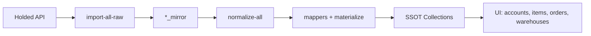

# Sistema de Normalización Holded → SSOT

## 📋 Arquitectura Completa

```
PASO 1: Importación RAW
Holded API → integrations/holded/*_mirror (JSON crudo)

PASO 2: Normalización
*_mirror → mappers + materialize() → SSOT collections
```

---

## 🗂️ Archivos Creados

### 1. **Plantillas con Defaults**
`src/server/integrations/holded/defaults.ts`
- Define TODOS los campos del SSOT
- Valores por defecto: `null`, `''`, `0`, `[]`
- NUNCA `undefined` (Firestore lo elimina)
- Helper `materialize()` para aplicar patches

### 2. **Mappers**
`src/server/integrations/holded/mappers.ts`
- `mapContactToAccount()` - Contact → Account
- `mapProductToItem()` - Product → Item
- `mapWarehouseToWarehouse()` - Warehouse → Warehouse
- `mapDocumentToOrder()` - Document → Order
- Todos usan `materialize()` para estructura completa

### 3. **Script de Normalización**
`src/server/integrations/holded/normalize-all.ts`
- Lee de mirrors
- Aplica mappers
- Escribe a SSOT con `merge: false`
- Batch processing (500 docs por batch)

### 4. **API Routes**
- `POST /api/integrations/holded/import-raw` - Importa RAW
- `POST /api/integrations/holded/normalize` - Normaliza al SSOT
- `GET /api/integrations/holded/export-raw` - Exporta mirrors

### 5. **UI**
`src/app/(app)/admin/integrations/holded/page.tsx`
- Botón morado: "Importar TODO (RAW)" - Paso 1
- Botón azul: "Normalizar al SSOT" - Paso 2
- Botón verde: "Exportar Datos RAW"

---

## 🚀 Cómo Usar

### Paso 1: Importación RAW
```bash
# Desde UI:
/admin/integrations/holded → Click "Importar TODO (RAW)"

# Desde terminal:
cd /path/to/project
npx tsx src/server/integrations/holded/import-all-raw.ts
```

**Resultado:**
```
integrations/holded/
  ├── contacts_mirror/
  ├── products_mirror/
  ├── documents_mirror/
  ├── warehouses_mirror/
  ├── stockmovements_mirror/
  └── payments_mirror/
```

### Paso 2: Normalización al SSOT
```bash
# Desde UI:
/admin/integrations/holded → Click "Normalizar al SSOT"

# Desde terminal:
npx tsx src/server/integrations/holded/normalize-all.ts
```

**Resultado:**
```
accounts/        ← mapContactToAccount()
items/           ← mapProductToItem()
warehouses/      ← mapWarehouseToWarehouse()
orders/          ← mapDocumentToOrder()
```

---

## ✅ Garantías del Sistema

### 1. **Estructura Completa**
Todos los documentos tienen TODOS los campos:
```typescript
// ✅ BIEN - Todos los campos presentes
{
  id: "123",
  name: "Acme Corp",
  legalName: null,        // Campo presente con null
  cif: null,              // Campo presente con null
  accountType: "OTRO",
  channels: [],           // Array vacío, no undefined
  // ... todos los demás campos
}

// ❌ MAL - Campos ausentes
{
  id: "123",
  name: "Acme Corp"
  // legalName no existe → Firestore OK, pero pérdida de homogeneidad
}
```

### 2. **Sin Undefined**
```typescript
// ✅ BIEN
const account = {
  name: "Test",
  legalName: null,        // null visible en Firestore
  cif: null,
}

// ❌ MAL
const account = {
  name: "Test",
  legalName: undefined,   // Firestore lo elimina!
  cif: undefined,
}
```

### 3. **Idempotencia**
- Puedes ejecutar ambos pasos múltiples veces
- Importación RAW: usa `merge: true`
- Normalización: usa `merge: false` (primera vez)

---

## 🔧 Funciones Clave

### `materialize<T>(template, patch): T`
Aplica un patch sobre una plantilla garantizando estructura completa:

```typescript
const account = materialize(DEFAULT_ACCOUNT, {
  name: "Acme Corp",
  cif: "B12345678",
  // Resto de campos vienen del DEFAULT_ACCOUNT
});

// Resultado: TODOS los campos presentes
```

### Mappers
```typescript
// Entrada: datos crudos de Holded
const raw = {
  id: "abc123",
  name: "Acme Corp",
  vatnumber: "B12345678",
  // ... otros campos de Holded
};

// Salida: Account SSOT completo
const account = mapContactToAccount(raw);
// → Tiene TODOS los campos del SSOT
```

---

## 📊 Colecciones Mirror

Cada documento en `*_mirror` tiene:
```typescript
{
  id: string,              // docId = holded.id
  holdedId: string,        // id original de Holded
  raw: any,                // JSON completo de API Holded
  syncedAt: ISODate,       // timestamp de sincronización
  source: 'API' | 'WEBHOOK',
  status: 'NEW' | 'UPDATED',
  createdAt: ISODate,
  updatedAt: ISODate,
}
```

---

## 🔄 Flujo Completo



---

## 📝 Próximos Pasos

### 1. **Webhooks Incrementales**
Actualizar mirrors cuando Holded notifica cambios:
- `contact.updated` → actualizar `contacts_mirror`
- `product.updated` → actualizar `products_mirror`
- Luego re-normalizar solo ese documento

### 2. **Mapeos Adicionales**
- `stockmovements_mirror` → `stockMoves`
- `payments_mirror` → `payments_mirror` (SSOT)

### 3. **Validaciones**
Añadir validaciones Zod antes de escribir al SSOT

---

## 🐛 Troubleshooting

### Problema: "Campos desaparecen en Firestore"
**Causa:** Usaste `undefined` en algún lugar
**Solución:** Usa `null`, `''`, `0`, o `[]`

### Problema: "Estructura inconsistente entre documentos"
**Causa:** No usaste `materialize()` o usaste `merge: true`
**Solución:** Usa `materialize()` + `merge: false` en primera pasada

### Problema: "Error de tipos TypeScript"
**Causa:** SSOT usa `undefined` para opcionales, pero queremos `null`
**Solución:** Usa `as any` en campos opcionales

---

## ✅ Checklist de Implementación

- [x] defaults.ts con plantillas completas
- [x] materialize() helper
- [x] Mappers para Contact, Product, Warehouse, Document
- [x] Script normalize-all.ts
- [x] API route /normalize
- [x] UI con botones Paso 1 y Paso 2
- [x] Logging detallado
- [x] Batch processing
- [x] Error handling
- [x] Documentación completa

---

## 🎯 Resultado Final

**Homogeneidad Total:**
- ✅ Todos los documentos tienen la misma estructura
- ✅ NUNCA hay `undefined`
- ✅ Fácil de auditar: `null` = vacío, ausente = error
- ✅ Compatible con Firestore
- ✅ Compatible con SSOT v7
- ✅ Type-safe con TypeScript

**Sistema listo para producción!** 🚀
