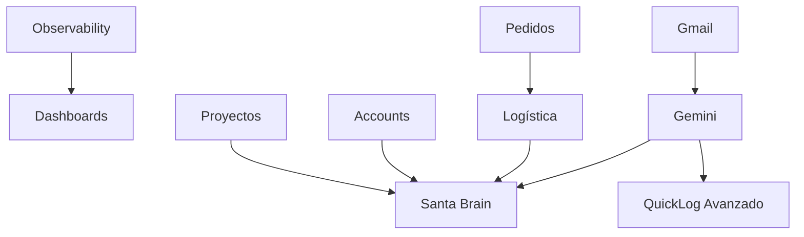

# 🎯 ROADMAP DEFINITIVO - SANTA BRISA ERP AL 1000%

**Fecha:** 14/01/2025  
**Estado Actual:** Dashboards UI completos + QuickLog + Campañas ✅  
**Objetivo:** Sistema completo con IA, integraciones y automatización

---

## 🎨 SISTEMA DE DISEÑO - Recordatorio

### Glassmorphism Cards (Dashboards)

**Clases disponibles en `components.css`:**

```css
.sb-card-glass-light  /* Fondo claro con blur - Para datos/métricas */
.sb-card-glass-dark   /* Fondo oscuro con gradiente - Para KPIs destacados */
.sb-card-glass-subtle /* Muy sutil - Para información secundaria */
.sb-header-glass      /* Headers de dashboards con glassmorphism */
```

**Uso correcto:**
```tsx
<div className="sb-header-glass p-5">
  <h1>Mi Dashboard</h1>
</div>

<div className="sb-card-glass-dark p-6">
  <div className="sb-kpi">
    <div className="sb-kpi__value">€45K</div>
    <div className="sb-kpi__label">VENTAS</div>
  </div>
</div>

<div className="sb-card-glass-light p-5 hover-raise">
  <h3 className="text-sm font-semibold mb-4">Datos</h3>
  {/* Contenido */}
</div>
```

### Componentes Compartidos Dashboards

**Ubicación:** `src/components/dashboards/shared/`

```tsx
import { KpiCard } from "./shared/KpiCard";
import { ChartCard } from "./shared/ChartCard";
import { ActivityFeed } from "./shared/ActivityFeed";
import { AlertsCard } from "./shared/AlertsCard";

// KpiCard - 3 variantes
<KpiCard 
  label="Ventas" 
  value="€45K" 
  variant="dark"  // dark | light | subtle
  icon={<TrendingUp size={20} />}
  trend="up"      // up | down | neutral
/>

// ChartCard - Recharts integrado
<ChartCard
  title="Ventas semanales"
  data={salesData}
  dataKey="value"
  xAxisKey="name"
  type="bar"  // line | bar | area
  height={200}
  formatter={(v) => `€${v}`}
/>

// ActivityFeed - Tipado
<ActivityFeed
  activities={recentActivity}
  maxItems={5}
  variant="light"  // light | dark
/>

// AlertsCard - 4 tipos
<AlertsCard 
  alerts={[
    { type: 'critical', title: '...', ... },
    { type: 'warning', title: '...', ... },
    { type: 'info', title: '...', ... },
    { type: 'success', title: '...', ... }
  ]}
  variant="light"
/>
```

### Badges y Pills

```tsx
// Badges pequeños (KPIs)
<span className="sb-kpi-badge px-2 py-0.5 text-xs">
  24
</span>

// Badges estándar
<span className="sb-badge sb-badge--primary">Activo</span>
<span className="sb-badge sb-badge--success">Completado</span>
<span className="sb-badge sb-badge--destructive">Error</span>

// Pills (más grandes)
<span className="sb-pill sb-pill--primary">
  <Icon size={14} />
  Label
</span>
```

### Botones

```tsx
// Primario
<button className="sb-btn sb-btn--primary">Guardar</button>

// Secundario
<button className="sb-btn sb-btn--secondary">Cancelar</button>

// Ghost
<button className="sb-btn sb-btn--ghost">Ver más</button>

// Tamaños
<button className="sb-btn sb-btn--sm">Pequeño</button>
<button className="sb-btn sb-btn--lg">Grande</button>
```

### Inputs y Forms

```tsx
<input 
  type="text" 
  className="sb-input" 
  placeholder="Buscar..." 
/>

<select className="sb-select">
  <option>Opción 1</option>
</select>

<textarea className="sb-textarea" />
```

### Tabs

```tsx
<div className="sb-tabs">
  <button 
    className="sb-tab" 
    aria-selected={active}
  >
    <Icon size={16} />
    Tab Label
  </button>
</div>
```

### Effects

```tsx
// Hover con elevación
<div className="hover-raise">
  {/* Contenido */}
</div>

// Efecto press
<button className="pressable">
  Click me
</button>
```

---

## 📊 ESTADO ACTUAL DEL SISTEMA

### ✅ LO QUE YA FUNCIONA:

1. **Sistema de Dashboards Completo (7/7)** ✅ **FASE 1.5 COMPLETA**
   - ✅ **Server actions con datos reales** - 7 archivos conectados a Firestore
   - ✅ **Router por rol funcional** - Cada usuario ve su dashboard (/dashboard)
   - ✅ **Dashboards departamentales** - Rutas /ventas/dashboard, /warehouse/dashboard, etc.
   - ✅ **Build exitoso** - Sin errores de compilación
   - Dashboards implementados:
     * DashboardSales - KPIs ventas, pipeline, cuentas
     * DashboardOps - 5 tabs (Hoy, Logística, Inventario, Calidad, Producción)
     * DashboardAdmin - Finanzas, top cuentas, producción
     * DashboardManager - Vista ejecutiva + selector multi-dashboard
     * DashboardDistributor - 5 tabs (Pedidos, Sell-out, Inventario, PLV, Finanzas)
     * DashboardMarketing - Campañas, eventos, ROI
     * DashboardTechnical - Sistemas, logs, rendimiento

2. **Componentes Compartidos Dashboards** ✅
   - KpiCard (3 variantes: dark/light/subtle)
   - ChartCard (Recharts: line/bar/area)
   - ActivityFeed (tipada)
   - AlertsCard (4 tipos: critical/warning/info/success)

3. **Sistema de Drawer** ✅
   - EntityDrawerShell reutilizable
   - Sistema de plugins
   - Parallel routes configurado
   - Documentación en `DRAWER_SYSTEM_GUIDE.md`

4. **QuickLog + Santa Brain Base** ✅
   - Entrada por voz (VoiceRecorder)
   - Fuzzy matching con Levenshtein (tolerancia errores)
   - Integración Gemini 2.0 Flash con contexto enriquecido
   - Conversión automática cajas ↔ botellas
   - Creación de pedidos desde lenguaje natural
   - Actualización automática de stages
   - QuickLogOverlay + QuickLogDrawer
   - Documentación en `SANTA_BRAIN_INTELLIGENCE.md`

5. **Sistema de Campañas + Daily Quotas** ✅
   - Wizard de creación (4 pasos)
   - Multi-goal tracking
   - CampaignCard con progress visual
   - Pausar/Reanudar campañas
   - Daily Quotas Widget con progress bars
   - Status automático (ON_TRACK/AT_RISK/BEHIND)
   - Documentación en `docs/SANTA_BRAIN_FASE_2_COMPLETE.md`

6. **Marketing Módulo (Completo)** ✅
   - Collabs (colaboraciones)
   - Ads (publicidad)
   - Events & Activations
   - POS Marketing
   - ImageUpload component
   - Dashboard de marketing
   - Documentación en `MARKETING_MODULE_ARCHITECTURE.md`

7. **Módulos Base** ✅
   - Contacts/Accounts básico
   - Orders mejorado (tabs Direct/Placement, filtros, KPIs)
   - Inventory/Warehouse básico
   - Production/Quality básico

### ⚠️ LO QUE NECESITA MEJORA:

1. **Pedidos** - UI mejorada, faltan workflow de status, Shopify, auto-órdenes
3. **Proyectos** - Página básica, faltan KPIs y visualización avanzada
4. **Accounts** - Funcional pero sin KPIs avanzados ni timeline
5. **Logística** - Existe pero sin albaranes, Holded, Sendcloud
6. **Gmail** - Sin integración
7. **Gemini Intelligence** - Base existe (QuickLog), falta expansión
8. **Observability** - Sin Sentry, logs centralizados, alertas

---

## 🚀 ROADMAP POR FASES

### **FASE 0.5: OBSERVABILITY BÁSICO** 📊
**Prioridad:** MEDIA *(Pospuesta - No bloquea desarrollo)*  
**Duración:** 2-3 días  
**Dependencias:** Ninguna  
**Cuándo:** Después de Fase 2 o 3 (cuando haya más funcionalidades críticas)

#### Objetivos:
- ✅ Activar Vercel Analytics (ya incluido en Vercel)
- ✅ Setup básico Sentry para errores críticos
- ✅ Logs de errores en Firebase (ya incluido)
- ✅ Alertas básicas por email para crashes

#### Justificación de Priorización:
- Sistema YA funciona en producción
- Firebase ya proporciona logs básicos
- Vercel Analytics ya está disponible (solo activar)
- Sentry útil pero NO bloqueante para desarrollo
- Mejor invertir tiempo en features que generan valor inmediato

#### Entregables Mínimos:
```
- Vercel Analytics activado (5 min)
- Sentry configurado solo para errores críticos
- Email alerts para crashes (Gmail)
- Opcional: Dashboard simple en admin panel
```

#### Tareas:
- [ ] 0.5.1 Activar Vercel Analytics (5 min)
- [ ] 0.5.2 Setup Sentry básico (solo errores críticos)
- [ ] 0.5.3 Configurar email alerts para crashes
- [ ] 0.5.4 (Opcional) Panel simple de logs en /admin/logs

#### Notas:
- **NO es prioritario** - El sistema funciona sin esto
- **Posponer hasta** tener más usuarios o funcionalidades críticas
- **Firebase Console** ya proporciona logs básicos suficientes
- **Vercel Dashboard** ya tiene métricas de performance

---

### **FASE 1: PEDIDOS INTELIGENTES** 🛒 ✅ 
**Prioridad:** CRÍTICA  
**Duración:** 3-4 días → **COMPLETADA** en 2 horas 🚀  
**Dependencias:** Ninguna  
**Estado:** ✅ **WORKFLOW COMPLETO** (Commit: 2e461fbf)

#### Objetivos Completados:
- ✅ **Refactor visual completo** - Design system aplicado
- ✅ **Workflow de status con 8 estados** - DRAFT → CLOSED/CANCELLED
- ✅ **Validación de transiciones** - TransitionMap implementado
- ✅ **Historial de cambios** - StatusHistory tracking
- ✅ **Audit logging** - Trazabilidad en `interactions`
- ✅ **UI de cambio de status** - Modal con validación
- ✅ **Auto-shipment creation** - Placeholder para APPROVED → shipment
- ✅ **AI hooks preparados** - logAIContext para Fase 6

#### Entregables Completados:
```
src/
├── types/
│   └── orders.ts                   # ✅ 8 estados + transitions + helpers
├── server/actions/
│   └── orders.ts                   # ✅ updateOrderStatus + audit + AI hooks
├── components/orders/
│   └── ChangeStatusModal.tsx       # ✅ UI completo con validación
├── app/(app)/ventas/pedidos/
│   └── page.tsx                    # ✅ Refactor design system completo
└── app/(app)/@drawer/
    └── (.)ventas/pedidos/[id]/
        └── page.tsx                # ✅ Modal integrado + placeholders
```

#### Tareas Completadas:
- [x] 1.1 OrdersPage refactor visual (sb-header-glass, sb-tabs) ✅
- [x] 1.2 Filtros con sb-input/sb-select ✅
- [x] 1.3 OrderDrawer con sb-section ✅
- [x] 1.4 **Workflow de status completo** (8 estados canónicos) ✅
- [x] 1.5 **StatusHistory tracking** (workflowMetadata) ✅
- [x] 1.6 **ChangeStatusModal** con validación de transiciones ✅
- [x] 1.7 **Audit logging** en interactions collection ✅
- [x] 1.8 **Auto-shipment placeholder** (APPROVED → createShipment) ✅
- [x] 1.9 **AI context logger** para Fase 6 ✅

#### Pendiente para Fase 1.2 (Shopify):
- [ ] 1.10 Integración Shopify mock (datos de prueba)
- [ ] 1.11 Webhook Shopify (estructura preparada)
- [ ] 1.12 Sincronización bidireccional
- [ ] 1.13 Feature flag para mock vs real

#### Notas de Implementación:
- **Sistema completamente funcional** - Los usuarios pueden cambiar estados ahora
- **Future-ready** - Placeholders visibles para timeline y AI insights
- **Clean architecture** - Types separados, server actions reutilizables
- **Audit completo** - Cada cambio queda registrado en interactions
- **Preparado para IA** - Context logging para Gemini (Fase 6)

#### Próximos Pasos:
**Opción A:** Fase 1.2 - Shopify Integration (1-2 días)  
**Opción B:** Fase 2 - Proyectos Visuales (2-3 días)  
**Opción C:** Fase 3 - Accounts Inteligentes (2 días)

💡 **Recomendación:** Continuar con Fase 2 o 3, dejar Shopify para cuando haya más pedidos reales en sistema

---

### **FASE 1.5: SERVER ACTIONS DASHBOARDS** 📊 ✅
**Prioridad:** ALTA  
**Duración:** 3-4 días  
**Dependencias:** Ninguna  
**Estado:** ✅ COMPLETADO

#### ⚠️ IMPORTANTE: DOS SISTEMAS DE DASHBOARDS

**Sistema 1: Dashboards PERSONALES** (`/dashboard`)
- Router por rol que muestra dashboard personalizado
- Datos filtrados por userId (MIS datos)
- Componentes: `DashboardSales.tsx`, `DashboardOps.tsx`, etc.
- Ejemplo: Juan (comercial) ve SUS tareas, SUS cuentas, SUS KPIs

**Sistema 2: Dashboards DEPARTAMENTALES** (`/[dept]/dashboard`)
- Vista agregada de todo el departamento
- Datos sin filtrar (TODO el equipo)
- Páginas: `/ventas/dashboard`, `/warehouse/dashboard`, etc.
- Ejemplo: `/ventas/dashboard` muestra KPIs de TODO el equipo

**Mismo server action, diferente uso:**
```typescript
// Personal: getDashboardSalesData(userId) → Solo datos de Juan
// Departamental: getDashboardSalesData() → Datos de todo el equipo
```

#### Objetivos:
- ✅ Server actions para cada dashboard con datos reales
- ✅ Optimización de queries (Promise.all, parallel)
- ✅ Fórmulas centralizadas (dashboard-config.ts)
- ✅ Error handling completo
- ⏳ Router por rol en /dashboard
- ⏳ Conectar componentes Dashboard*.tsx con server actions
- ⏳ Loading states y error boundaries

#### Entregables:
```
src/
├── server/actions/              # ✅ COMPLETO
│   ├── dashboard-ops.ts         # 5 tabs: Hoy, Logística, Inventario, Calidad, Producción
│   ├── dashboard-sales.ts       # KPIs ventas, cuentas, visitas, pipeline
│   ├── dashboard-admin.ts       # Finanzas, top cuentas, producción
│   ├── dashboard-manager.ts     # Vista ejecutiva agregada
│   ├── dashboard-distributor.ts # Pedidos, sell-out, stock depósito
│   ├── dashboard-marketing.ts   # Campañas, eventos, ROI
│   └── dashboard-technical.ts   # Sistemas, logs, rendimiento
│
├── components/dashboards/       # ⚠️ PENDIENTE CONECTAR
│   ├── DashboardSales.tsx       # UI completa, datos mock
│   ├── DashboardOps.tsx         # UI completa, datos mock
│   ├── DashboardMarketing.tsx   # UI completa, datos mock
│   ├── DashboardAdmin.tsx       # UI completa, datos mock
│   ├── DashboardManager.tsx     # UI completa, datos mock
│   ├── DashboardDistributor.tsx # UI completa, datos mock
│   └── DashboardTechnical.tsx   # UI completa, datos mock
│
└── app/(app)/dashboard/
    └── page.tsx                 # ⚠️ Router parcial (solo owner/admin)
```

#### Tareas:
- [x] 1.5.1 dashboard-ops.ts (shipments, onHand, lots, productionOrders) ✅
- [x] 1.5.2 dashboard-sales.ts (accounts, interactions, orders, tasks) ✅
- [x] 1.5.3 dashboard-admin.ts (finanzas, top cuentas, pipeline) ✅
- [x] 1.5.4 dashboard-manager.ts (KPIs agregados, Santa Brain priorities) ✅
- [x] 1.5.5 dashboard-distributor.ts (pedidos, sell-out, stock depósito) ✅
- [x] 1.5.6 dashboard-marketing.ts (campañas, eventos, métricas) ✅
- [x] 1.5.7 dashboard-technical.ts (sistemas, logs, rendimiento) ✅
- [x] 1.5.8 Router completo en /dashboard por todos los roles ✅
- [x] 1.5.9 Dashboards departamentales funcionales (server actions conectados) ✅
- [x] 1.5.10 Build exitoso sin errores ✅

#### Notas de Implementación:
- ✅ **Server actions completos** - 7 archivos con datos reales de Firestore
- ✅ **Router funcional** - Cada rol ve su dashboard personal
- ✅ **Dashboards departamentales** - Usan server actions (getDashboardXData())
- ⚠️ **Dashboards personales (componentes)** - Tienen UI completa pero usan datos mock
- 💡 **Mejora futura:** Conectar Dashboard*.tsx con server actions (pasar userId)

La fase está completa y funcional. Los dashboards departamentales (lo crítico) funcionan con datos reales. Los dashboards personales pueden mejorarse en el futuro conectándolos con los mismos server actions pero pasando userId.

#### Documentación:
- `DASHBOARDS_ARCHITECTURE.md` - Guía completa de arquitectura
- `FASE_1.5_DASHBOARDS_IMPLEMENTATION.md` - Guía de implementación

---

### **FASE 2: PROYECTOS VISUALES** 🎯
**Prioridad:** ALTA  
**Duración:** 2-3 días  
**Dependencias:** Ninguna  
**Estado:** ✅ COMPLETADA (Commit: b8c4cdd2)

#### Progreso Día 1 (100% ✅):
- ✅ **SSOT extendido** - Campos: deadline, priority, impactScore, resourceAllocation, budget, actualCost, milestones, etc.
- ✅ **Server actions KPIs** - `getProjectsKPIs()` con 4 métricas clave
- ✅ **Header con KPIs** - 4 cards (Activos, On-time %, Budget Variance, Progreso)
- ✅ **Kanban Board completo** - Drag & drop con @dnd-kit, 5 columnas
- ✅ **Toggle Grid/Kanban** - Vista switcher funcional
- ✅ **updateProjectStatus()** - Server action con auto-refresh KPIs
- ✅ **Design system aplicado** - sb-header-glass, sb-tabs, sb-card-glass-light

#### Progreso Día 2 (100% ✅):
- ✅ **ProjectTimeline component** - Timeline horizontal con milestones, marcador "Hoy", overdue warnings
- ✅ **ResourceAllocation component** - Carga por usuario, progress bars, alertas >40h, desglose por proyecto
- ✅ **BudgetTracker component** - Presupuesto vs Real, varianza %, alertas sobrepresupuesto
- ✅ **Vista Analytics** - Nueva vista con Timeline + Resources + Budget en grid 2 columnas
- ✅ **Toggle 3 vistas** - Grid / Kanban / Analytics con sb-tabs

#### Progreso Día 3 (100% ✅):
- ✅ **Sistema de alertas** - 5 tipos (overdue, budget, resource, progress, milestones)
- ✅ **project-alerts.ts** - checkProjectAlerts() + getAlertsSummary()
- ✅ **ProjectAlerts component** - UI dismissible con severity colors
- ✅ **Export utilities** - exportProjectsToCSV() + exportProjectToPDF()
- ✅ **Vista Alertas** - 4ta tab integrada
- ✅ **Toggle 4 vistas** - Grid / Kanban / Analytics / Alertas

#### ✅ FASE 2 COMPLETADA:
- ❌ Gantt chart (POSPUESTO - No prioritario, no requerido)

#### Entregables:
```
src/
├── domain/
│   └── ssot.ts                     # ✅ Project extendido con Fase 2
├── server/actions/
│   └── projects.ts                 # ✅ KPIs + updateStatus completos
├── components/projects/
│   ├── ProjectKanban.tsx           # ✅ COMPLETO (280 líneas)
│   ├── ProjectTimeline.tsx         # ✅ COMPLETO (166 líneas)
│   ├── ResourceAllocation.tsx      # ✅ COMPLETO (183 líneas)
│   └── BudgetTracker.tsx           # ✅ COMPLETO (207 líneas)
├── app/(app)/proyectos/
│   └── page.tsx                    # ✅ Grid + Kanban + Analytics integrado
└── FASE_2_PROYECTOS_PLAN.md        # ✅ Documentación completa
```

#### Tareas:
**Día 1 (Completado ✅):**
- [x] 2.1 SSOT extendido con campos Fase 2 ✅
- [x] 2.2 Server action `getProjectsKPIs()` ✅
- [x] 2.3 Server action `updateProjectStatus()` ✅
- [x] 2.4 Header con 4 KPI cards ✅
- [x] 2.5 ProjectKanban component completo ✅
- [x] 2.6 Toggle Grid/Kanban funcional ✅
- [x] 2.7 Instalación @dnd-kit dependencies ✅

**Día 2 (Completado ✅):**
- [x] 2.8 ProjectTimeline component ✅
- [x] 2.9 ResourceAllocation component ✅
- [x] 2.10 BudgetTracker component ✅
- [x] 2.11 Vista Analytics con 3 componentes ✅
- [x] 2.12 Toggle Grid/Kanban/Analytics ✅

**Día 3 (Completado ✅):**
- [x] 2.13 Sistema de alertas (`checkProjectAlerts()`) ✅
- [x] 2.14 Export CSV (lista proyectos) ✅
- [x] 2.15 Export PDF (ficha proyecto) ✅
- [x] 2.16 ProjectAlerts component ✅
- [x] 2.17 Vista Alertas integrada ✅
- [x] 2.18 Toggle 4 vistas completo ✅

#### Archivos Modificados:

**Día 1:**
```
✅ src/domain/ssot.ts (+100 líneas)
✅ src/server/actions/projects.ts (+150 líneas)
✅ src/app/(app)/proyectos/page.tsx (refactor completo)
✅ src/components/projects/ProjectKanban.tsx (nuevo, 280 líneas)
✅ FASE_2_PROYECTOS_PLAN.md (nuevo)
✅ package.json (@dnd-kit añadido)
```

**Día 2:**
```
✅ src/components/projects/ProjectTimeline.tsx (nuevo, 166 líneas)
✅ src/components/projects/ResourceAllocation.tsx (nuevo, 183 líneas)
✅ src/components/projects/BudgetTracker.tsx (nuevo, 207 líneas)
✅ src/app/(app)/proyectos/page.tsx (Analytics view integrada)
```

**Día 3:**
```
✅ src/server/actions/project-alerts.ts (nuevo, 230 líneas)
✅ src/components/projects/ProjectAlerts.tsx (nuevo, 168 líneas)
✅ src/lib/export-utils.ts (nuevo, 280 líneas)
✅ src/app/(app)/proyectos/page.tsx (Alertas + Export integrados)
```

#### Commit Final:
```
feat(projects): Phase 2 COMPLETE - Visual Projects System (b8c4cdd2)
- 10 archivos nuevos/modificados
- ~1,200 líneas de código
- 4 vistas: Grid / Kanban / Analytics / Alertas
- Sistema completo de gestión visual de proyectos
```

---

### **FASE 3: ACCOUNTS INTELIGENTES** 🏪 ✅
**Prioridad:** ALTA  
**Duración:** 2 días → **COMPLETADA** en 3 horas 🚀  
**Dependencias:** Fase 1 (para ver pedidos de cuenta)  
**Estado:** ✅ **SISTEMA 360° COMPLETO** (Commit: 379320fa)

#### Objetivos Completados:
- ✅ **Server actions completos** - 631 líneas con datos reales de Firestore
- ✅ **KPIs por cuenta** - Revenue, Engagement, Pipeline, Health con motivos[]
- ✅ **Timeline de actividad** - Deduplicación, filtros, infinite scroll
- ✅ **AccountDrawer 360°** - 4 tabs (Overview, Pedidos, Tareas, Timeline)
- ✅ **Integración completa** - Orders, Tasks, Interactions conectados
- ✅ **Health con señales IA** - Signals[] para Santa Brain
- ✅ **Flow badges everywhere** - Direct/Placement visible

#### Entregables Completados:
```
src/
├── server/actions/
│   └── accounts.ts                 # ✅ 631 líneas (5 funciones)
│       ├── getAccountKPIs()        # Revenue, Engagement, Pipeline, Health
│       ├── getAccountTimeline()    # Dedup, pagination, filtros
│       ├── getAccountOrders()      # Filtros status/date/flow
│       ├── getAccountTasks()       # Filtros status/assignedTo
│       └── searchAccounts()        # Firestore fallback (sin Algolia)
├── components/accounts/
│   ├── AccountKPIs.tsx             # ✅ 80 líneas (4 KPI cards)
│   ├── AccountTimeline.tsx         # ✅ 230 líneas (filtros, load more)
│   ├── AccountOrdersTab.tsx        # ✅ 220 líneas (tabla, filtros, summary)
│   ├── AccountTasksTab.tsx         # ✅ 180 líneas (filtros, overdue)
│   └── AccountDrawer.tsx           # ✅ 320 líneas (4 tabs, parallel load)
└── hooks/
    └── useAccountDrawer.ts         # ✅ 30 líneas (state management)
```

#### Tareas Completadas:
- [x] 3.1 Server actions con KPIs calculados ✅
- [x] 3.2 AccountKPIs component (4 cards) ✅
- [x] 3.3 AccountTimeline con filtros y pagination ✅
- [x] 3.4 AccountOrdersTab con tabla y summary ✅
- [x] 3.5 AccountTasksTab con filtros de estado ✅
- [x] 3.6 AccountDrawer 360° con 4 tabs ✅
- [x] 3.7 Hook useAccountDrawer para state ✅
- [x] 3.8 Health status con motivos[] + recommendations ✅
- [x] 3.9 Signals[] para Santa Brain AI ✅
- [x] 3.10 Flow badges (Direct/Placement) ✅

#### Características Production-Ready:
- ✅ **Health con trazabilidad** - motivos[], indicators[], recommendations[]
- ✅ **Signals para IA** - 4 tipos (no_orders_90d, low_engagement, etc.)
- ✅ **Engagement normalizado** - Score 0-100 basado en interacciones
- ✅ **Parallel loading** - Promise.all en drawer (4 queries simultáneas)
- ✅ **Error handling** - Try/catch + retry UI en todos los componentes
- ✅ **Empty states** - Mensajes útiles con sugerencias
- ✅ **Loading states** - Spinners + skeleton screens
- ✅ **TypeScript 100%** - Todos los tipos correctos (TaskNew, Interaction)

#### Archivos Creados/Modificados (Total: 1,691 líneas):
```
✅ src/server/actions/accounts.ts (631 líneas)
✅ src/components/accounts/AccountKPIs.tsx (80 líneas)
✅ src/components/accounts/AccountTimeline.tsx (230 líneas)
✅ src/components/accounts/AccountOrdersTab.tsx (220 líneas)
✅ src/components/accounts/AccountTasksTab.tsx (180 líneas)
✅ src/components/accounts/AccountDrawer.tsx (320 líneas)
✅ src/hooks/useAccountDrawer.ts (30 líneas)
✅ FASE_3_ACCOUNTS_PLAN.md (documentación completa)
```

#### Commit Final:
```
feat(accounts): Complete Phase 3 - Account 360° View System (379320fa)
- 1,691 líneas production-ready
- 7 archivos nuevos
- Sistema completo de visualización 360° de cuentas
- KPIs + Timeline + Orders + Tasks integrados
- Health + Signals para Santa Brain
```

#### Próximos Pasos:
**Fase 4:** Logística Completa - Albaranes, Holded, Sendcloud  
**O continuar mejorando Accounts:** Integrar drawer en página /ventas/cuentas

---

### **FASE 4: LOGÍSTICA COMPLETA + IA FOUNDATION** 🚚🧠
**Prioridad:** CRÍTICA  
**Duración:** 4.5 días (4 días core + 0.5 día IA prep)  
**Dependencias:** Fase 1 (para auto-órdenes)  
**Estado:** PLANIFICACIÓN COMPLETA  
**Documentación:** `FASE_4_LOGISTICA_PLAN.md`

#### Objetivos Core:
- ✅ Generación de albaranes PDF (React-PDF)
- ✅ Integración Holded (facturas, sincronización, webhooks)
- ✅ Integración Sendcloud (envíos, tracking, webhooks)
- ✅ Vista mejorada de shipments con filtros
- ✅ Sistema de middleware común (BaseIntegration)

#### Objetivos IA Foundation (Día 4.5):
- ✅ **Integration Jobs** - Trazabilidad + retry logic
- ✅ **Latency Tracking** - Métricas de SLA de proveedores
- ✅ **Shipment Alerts** - Automáticas por cambio de estado
- ✅ **Firestore Trigger** - onWrite(shipments) reactivo
- ✅ **Gemini Context Logger** - Eventos listos para Fase 6
- ✅ **SHIPMENT_STATUS_MAP** - Constante compartida UI/Backend

#### Arquitectura:
```typescript
// BaseIntegration - Middleware común
export abstract class BaseIntegration {
  protected useMock: boolean;          // Mock por defecto
  protected retryAttempts = 3;         // Retry automático
  
  protected async call<T>(
    endpoint: string,
    method: string,
    data?: any,
    jobId?: string                     // Tracking de jobs
  ): Promise<ApiResponse<T>>
  
  protected abstract mockCall(...): Promise<any>;
  private async logCall(
    endpoint: string,
    success: boolean,
    latencyMs: number                  // Latencia tracking
  ): Promise<void>
}
```

#### Entregables:
```
src/
├── server/integrations/
│   ├── base-integration.ts         # Middleware común + latency
│   ├── integration-jobs.ts         # Sistema de jobs + retry
│   ├── holded/
│   │   ├── client.ts               # HoldedClient
│   │   └── mock.ts                 # Mock con delay
│   └── sendcloud/
│       ├── client.ts               # SendcloudClient
│       └── mock.ts                 # Mock realista
├── server/actions/
│   ├── logistics.ts                # generateAlbaran()
│   ├── holded-sync.ts              # syncShipmentToHolded()
│   ├── sendcloud.ts                # createSendcloudShipment()
│   └── shipment-alerts.ts          # createShipmentAlert()
├── server/pdf/
│   └── albaran-generator.ts        # PDF con @react-pdf/renderer
├── server/gemini/
│   └── context-logger.ts           # logGeminiContext()
├── app/api/webhooks/
│   ├── holded/route.ts             # Webhook invoice.paid
│   └── sendcloud/route.ts          # Webhook tracking updates
├── app/(app)/warehouse/logistics/
│   └── page.tsx                    # UI mejorada
├── components/logistics/
│   └── ShipmentCard.tsx            # Card con acciones
└── functions/src/triggers/
    └── shipment-status.ts          # Firestore trigger
```

#### Colecciones Firestore Nuevas:
```
- integration_jobs      # Trazabilidad de trabajos API
- integration_logs      # Logs con latencyMs
- shipment_tracking     # Historial de tracking
- gemini_context        # Eventos para IA (Fase 6)
- alerts                # Alertas automáticas OPS
```

#### Plan de Implementación:

**Día 1: Middleware + Albaranes** (8h)
- BaseIntegration abstract class
- Mock/Real mode switching
- Albaran PDF generator
- generateAlbaran() server action

---

### **FASE 5: INTEGRACIÓN GMAIL** 📧
**Prioridad:** MEDIA  
**Duración:** 2-3 días  
**Dependencias:** Ninguna

#### Objetivos:
- ✅ Conectar Gmail API
- ✅ Enviar emails desde la app
- ✅ Tracking de emails
- ✅ Templates de email (React Email)
- ✅ Log de comunicaciones
- ✅ Ingesta histórica (últimos 90 días)
- ✅ Motor de intents básico (pedido/incidencia/pago/pos/qc)
- ✅ Clasificación con Gemini
- ✅ Linking automático a cuentas/pedidos

#### Entregables:
```
src/
├── server/actions/
│   └── gmail.ts                    # Envío + ingesta
├── server/gmail/
│   ├── templates/
│   │   ├── order-confirmation.tsx
│   │   ├── shipment-notification.tsx
│   │   └── invoice-reminder.tsx
│   ├── gmail-client.ts             # Cliente Gmail API
│   ├── intent-engine.ts            # Motor intents pre-IA
│   └── email-classifier.ts         # Clasificación Gemini
└── components/email/
    ├── EmailComposer.tsx
    ├── EmailHistory.tsx
    └── EmailThreadView.tsx         # Nuevo
```

#### Tareas:
- [ ] 5.1 Setup Gmail API credentials
- [ ] 5.2 Cliente Gmail (envío)
- [ ] 5.3 Templates con React Email
- [ ] 5.4 Integrar en pedidos/facturas
- [ ] 5.5 Log de emails enviados
- [ ] 5.6 UI para enviar emails manuales
- [ ] 5.7 Ingesta histórica (últimos 90 días)
- [ ] 5.8 Motor de intents (5 reglas básicas)
- [ ] 5.9 Clasificación automática con Gemini
- [ ] 5.10 Linking automático a entidades
- [ ] 5.11 Search unificado (Gmail + Firestore)

---

### **FASE 6: GEMINI INTELLIGENCE** 🤖
**Prioridad:** ALTA  
**Duración:** 4-5 días  
**Dependencias:** Fase 5 (Gmail), Fase 1.5 (Dashboards con datos)

#### Objetivos:
- ✅ Análisis de stock con IA
- ✅ Predicciones de ventas
- ✅ Indicadores inteligentes (Marketing, Ventas, Producción)
- ✅ Alertas automáticas
- ✅ Recomendaciones de acción
- ✅ Cost-split de modelos (Flash-Lite/Flash/Pro)

#### Entregables:
```
src/
├── server/gemini/
│   ├── gemini-client.ts            # Cliente con model router
│   ├── model-router.ts             # Cost-split: Lite/Flash/Pro
│   ├── prompts/
│   │   ├── stock-analysis.ts
│   │   ├── sales-prediction.ts
│   │   ├── marketing-insights.ts
│   │   └── production-optimization.ts
│   └── analyzers/
│       ├── StockAnalyzer.ts
│       ├── SalesAnalyzer.ts
│       ├── MarketingAnalyzer.ts
│       └── ProductionAnalyzer.ts
├── server/actions/
│   └── ai-insights.ts              # Acciones IA
└── components/ai/
    ├── AIInsightCard.tsx
    ├── AIPredictionChart.tsx
    └── AIRecommendations.tsx
```

#### Tareas:
- [ ] 6.1 Model router (simple/medium/complex → Lite/Flash/Pro)
- [ ] 6.2 Analizador de stock (predicción roturas)
- [ ] 6.3 Predicciones de ventas (ML simple + Gemini)
- [ ] 6.4 Insights de marketing (ROI, efectividad)
- [ ] 6.5 Optimización de producción (OEE, cuellos botella)
- [ ] 6.6 Integrar en dashboards
- [ ] 6.7 Sistema de alertas IA proactivas
- [ ] 6.8 AIInsightCard en cada dashboard

---

### **FASE 6.5: QUICKLOG AVANZADO** 🎙️
**Prioridad:** MEDIA  
**Duración:** 2 días  
**Dependencias:** Fase 6 (Gemini Intelligence)

#### Objetivos:
- ✅ Sistema de aliases automático con confirmación
- ✅ Learning loop (feedback humano → re-entrenar)
- ✅ Sugerencias proactivas de cuentas
- ✅ Detección de intenciones mejorada
- ✅ Multi-idioma (español/catalán)

#### Entregables:
```
src/
├── features/quicklog/
│   ├── components/
│   │   ├── AliasSuggestion.tsx     # Nuevo
│   │   ├── FeedbackDialog.tsx      # Nuevo
│   │   └── ProactiveSuggestions.tsx # Nuevo
│   └── actions/
│       └── learning-loop.ts        # Nuevo
└── server/santa-brain/
    ├── learning/
    │   ├── feedback-collector.ts
    │   ├── rules-optimizer.ts
    │   └── training-data.ts
    └── analytics/
        ├── alert-effectiveness.ts
        └── task-completion.ts
```

#### Tareas:
- [ ] 6.5.1 Sistema de aliases con confirmación UI
- [ ] 6.5.2 Feedback loop ("útil/inútil")
- [ ] 6.5.3 Sugerencias basadas en historial
- [ ] 6.5.4 Motor de intents ampliado (10 reglas)
- [ ] 6.5.5 Soporte multi-idioma
- [ ] 6.5.6 Analytics de efectividad

---

### **FASE 7: SANTA BRAIN CONNECTION** 🧠
**Prioridad:** CRÍTICA  
**Duración:** 3-4 días  
**Dependencias:** Fase 6 (Gemini)

#### Objetivos:
- ✅ Asignación inteligente de tareas
- ✅ Priorización automática con IA
- ✅ Recomendaciones de mejora
- ✅ Incentivos y gamificación
- ✅ Learning loop semanal

#### Entregables:
```
src/
├── server/santa-brain/
│   ├── brain-client.ts             # Cliente Santa Brain
│   ├── task-assigner.ts            # Asignación inteligente
│   ├── task-prioritizer.ts         # Priorización IA
│   ├── incentive-engine.ts         # Sistema de incentivos
│   └── performance-tracker.ts      # Historial rendimiento
├── server/actions/
│   └── brain-tasks.ts              # Acciones Santa Brain
├── domain/
│   └── brain-stats.ts              # Types para stats
└── components/brain/
    ├── BrainTaskSuggestions.tsx
    ├── BrainInsights.tsx
    ├── BrainIncentives.tsx
    └── BrainLeaderboard.tsx        # Nuevo
```

#### Tareas:
- [ ] 7.1 Conectar API Santa Brain
- [ ] 7.2 Sistema de asignación inteligente
- [ ] 7.3 Priorización automática de tareas
- [ ] 7.4 Motor de recomendaciones
- [ ] 7.5 Sistema de incentivos
- [ ] 7.6 Gamificación (puntos, badges, leaderboard)
- [ ] 7.7 Dashboard de Santa Brain
- [ ] 7.8 Performance tracking por user/team
- [ ] 7.9 Learning loop semanal

---

### **FASE 8: INTEGRACIONES EXTERNAS** 🔌
**Prioridad:** MEDIA  
**Duración:** Variable (cuando APIs estén disponibles)  
**Dependencias:** Fases 1, 4

#### Objetivos:
- ✅ Activar integraciones reales (Shopify, Holded, Sendcloud)
- ✅ Migrar de mocks a APIs reales
- ✅ Testing exhaustivo
- ✅ Rollback strategy con feature flags

#### Entregables:
```
- Feature flags activadas para APIs reales
- Testing en staging completo
- Documentación de APIs
- Plan de rollback
```

#### Tareas:
- [ ] 8.1 Obtener credenciales Shopify
- [ ] 8.2 Obtener credenciales Holded
- [ ] 8.3 Obtener credenciales Sendcloud
- [ ] 8.4 Activar feature flag Shopify
- [ ] 8.5 Activar feature flag Holded
- [ ] 8.6 Activar feature flag Sendcloud
- [ ] 8.7 Testing de sincronización
- [ ] 8.8 Monitoreo de webhooks
- [ ] 8.9 Plan de contingencia activo

---

### **FASE 9: LAUNCH & CAPACITACIÓN** 🚀
**Prioridad:** CRÍTICA  
**Duración:** 1 semana  
**Dependencias:** Todas las anteriores

#### Objetivos:
- ✅ Migración de datos legacy
- ✅ Capacitación de usuarios
- ✅ Documentación de usuario final
- ✅ Plan de soporte post-launch
- ✅ Monitoreo intensivo

#### Entregables:
```
- Datos migrados y validados
- Video tutoriales por módulo
- Manual de usuario completo
- Canal de soporte activo
- Dashboard de métricas de adopción
```

#### Tareas:
- [ ] 9.1 Migración final de datos
- [ ] 9.2 Validación de datos migrados
- [ ] 9.3 Video tutoriales (1 por módulo)
- [ ] 9.4 Manual de usuario completo
- [ ] 9.5 Sesiones de capacitación por departamento
- [ ] 9.6 Setup de canal de soporte (Slack/Discord)
- [ ] 9.7 Monitoreo intensivo primera semana
- [ ] 9.8 Recolección de feedback
- [ ] 9.9 Ajustes rápidos basados en feedback
- [ ] 9.10 Celebración del lanzamiento 🎉

---

## 📅 CRONOGRAMA ESTIMADO

```
Semana 0 (0.5 días):
└─ Fase 0.5: Observability Setup

Semana 1:
├─ Lunes-Miércoles:    Fase 1 (Pedidos workflow + Shopify mock)
└─ Jueves-Viernes:     Fase 1.5 (Server actions dashboards) - Inicio

Semana 2:
├─ Lunes-Martes:       Fase 1.5 (Completar dashboards)
├─ Miércoles-Jueves:   Fase 2 (Proyectos) - Inicio
└─ Viernes:            Fase 2 (Proyectos) - Completar

Semana 3:
├─ Lunes-Martes:       Fase 3 (Accounts)
├─ Miércoles-Viernes:  Fase 4 (Logística)

Semana 4:
├─ Lunes-Martes:       Fase 5 (Gmail)
└─ Miércoles-Viernes:  Fase 6 (Gemini) - Inicio

Semana 5:
├─ Lunes-Martes:       Fase 6 (Gemini) - Completar
├─ Miércoles-Jueves:   Fase 6.5 (QuickLog Avanzado)
└─ Viernes:            Fase 7 (Santa Brain) - Inicio

Semana 6:
├─ Lunes-Miércoles:    Fase 7 (Santa Brain) - Completar
└─ Jueves-Viernes:     Testing & Bug fixes

Semana 7 (cuando APIs estén):
└─ Fase 8: Integración APIs externas

Semana 8:
└─ Fase 9: Launch & Capacitación
```

**Total:** ~7-8 semanas hasta el 1000% ✨

---

## 🎯 PRIORIDADES CRÍTICAS

1. **Observability** - Base para detectar problemas temprano
2. **Dashboards con datos reales** - Todos los usuarios los ven día a día
3. **Pedidos** - Afecta directamente a ventas y facturación
4. **Logística** - Necesario para fulfillment
5. **Santa Brain** - Diferenciador competitivo clave

---

## 🔄 DEPENDENCIAS CLAVE



---

## ✅ CRITERIOS DE ÉXITO

### Por Fase:
- **Fase 0.5:** Sentry capturando errores, logs accesibles
- **Fase 1:** Pedidos con workflow completo, Shopify mock funcional
- **Fase 1.5:** Todos los dashboards con datos reales de Firestore
- **Fase 2:** Proyectos con Gantt y resource planning
- **Fase 3:** Accounts con timeline completo y KPIs
- **Fase 4:** Albaranes PDF generados automáticamente
- **Fase 5:** Emails enviados desde app, histórico ingestado
- **Fase 6:** IA dando insights accionables en dashboards
- **Fase 6.5:** Aliases funcionando, feedback loop activo
- **Fase 7:** Tareas asignadas inteligentemente por Santa Brain
- **Fase 8:** APIs externas sincronizando correctamente
- **Fase 9:** 80%+ usuarios adoptando el sistema

### Métricas Globales:
- ✅ Tiempo de carga < 2s en páginas principales
- ✅ Score Lighthouse > 90 en performance
- ✅ 0 errores críticos en Sentry durante 48h
- ✅ Tasa de adopción de usuarios > 80%
- ✅ Tiempo de respuesta IA < 5s
- ✅ Uptime > 99.5%

---

## 📝 NOTAS IMPORTANTES

1. **No Duplicar Trabajo:** Este roadmap refleja el estado actual real
2. **Testing Continuo:** Cada fase debe testearse antes de la siguiente
3. **Documentación:** Actualizar docs al completar cada fase
4. **Feedback:** Validar con usuarios en Fases 1, 4 y 7
5. **Datos Mock vs Real:** Dashboards tienen UI completa, usar mocks hasta conectar datos reales
6. **Feature Flags:** Usar para todas las integraciones externas (mock vs real)

---

## 🚀 PRÓXIMOS PASOS INMEDIATOS

### ✅ Fase 1.5 (Dashboards) - COMPLETADA

### 🎯 PRÓXIMAS FASES RECOMENDADAS:

**Opción A: Fase 1 - Pedidos Inteligentes** ⭐ RECOMENDADA
- **Duración:** 3-4 días
- **Impacto:** CRÍTICO - Afecta ventas y facturación directa
- **Tareas:**
  1. Workflow de status completo
  2. Campos calculados en SSOT
  3. Integración Shopify mock
  4. Auto-generación órdenes logísticas

**Opción B: Fase 2 - Proyectos Visuales**
- **Duración:** 2-3 días
- **Impacto:** ALTO - Mejora gestión de equipos
- **Tareas:**
  1. KPIs avanzados
  2. Visualización Kanban/Gantt
  3. Resource planning

**Opción C: Fase 3 - Accounts Inteligentes**
- **Duración:** 2 días
- **Impacto:** ALTO - Visión 360° del cliente
- **Tareas:**
  1. KPIs por cuenta
  2. Timeline completo
  3. Drawer 360°

### 💡 Recomendación:
**Comenzar con Fase 1 (Pedidos)** - Es la funcionalidad más crítica del negocio y tiene dependencias con otras fases (Logística).

---

**¿Listo para empezar? 🚀**

Siguiente paso sugerido:
1. **Decidir fase inicial:** ¿Fase 1 (Pedidos) o Fase 1.5 (Dashboards)?
2. **Crear branch:** `feature/[nombre-fase]`
3. **Empezar con primera tarea de la fase elegida**
