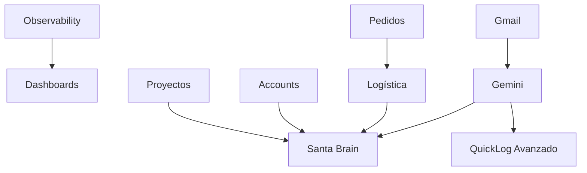

# 🎯 ROADMAP DEFINITIVO - SANTA BRISA ERP AL 1000%

**Fecha:** 14/01/2025  
**Estado Actual:** Dashboards UI completos + QuickLog + Campañas ✅  
**Objetivo:** Sistema completo con IA, integraciones y automatización

---

## 📊 ESTADO ACTUAL DEL SISTEMA

### ✅ LO QUE YA FUNCIONA:

1. **Dashboards Departamentales (7/7)** ✅
   - Dashboard personal ✅
   - DashboardOps (5 tabs: Hoy, Logística, Inventario, Calidad, Producción) ✅
   - DashboardSales (Pipeline, visitas, cuentas, alertas) ✅
   - DashboardAdmin (Finanzas, top cuentas, producción) ✅
   - DashboardManager (Vista ejecutiva + selector multi-dashboard) ✅
   - DashboardDistributor (5 tabs: Pedidos, Sell-out, Inventario, PLV, Finanzas) ✅
   - DashboardMarketing ✅
   - DashboardTechnical ✅
   - **✅ Server actions implementados** - 7 dashboards con datos reales de Firestore
   - **⚠️ Pendiente:** Router por rol, loading states, error boundaries

2. **Componentes Compartidos Dashboards** ✅
   - KpiCard (3 variantes: dark/light/subtle)
   - ChartCard (Recharts: line/bar/area)
   - ActivityFeed (tipada)
   - AlertsCard (4 tipos: critical/warning/info/success)

3. **Sistema de Drawer** ✅
   - EntityDrawerShell reutilizable
   - Sistema de plugins
   - Parallel routes configurado
   - Documentación en `DRAWER_SYSTEM_GUIDE.md`

4. **QuickLog + Santa Brain Base** ✅
   - Entrada por voz (VoiceRecorder)
   - Fuzzy matching con Levenshtein (tolerancia errores)
   - Integración Gemini 2.0 Flash con contexto enriquecido
   - Conversión automática cajas ↔ botellas
   - Creación de pedidos desde lenguaje natural
   - Actualización automática de stages
   - QuickLogOverlay + QuickLogDrawer
   - Documentación en `SANTA_BRAIN_INTELLIGENCE.md`

5. **Sistema de Campañas + Daily Quotas** ✅
   - Wizard de creación (4 pasos)
   - Multi-goal tracking
   - CampaignCard con progress visual
   - Pausar/Reanudar campañas
   - Daily Quotas Widget con progress bars
   - Status automático (ON_TRACK/AT_RISK/BEHIND)
   - Documentación en `docs/SANTA_BRAIN_FASE_2_COMPLETE.md`

6. **Marketing Módulo (Completo)** ✅
   - Collabs (colaboraciones)
   - Ads (publicidad)
   - Events & Activations
   - POS Marketing
   - ImageUpload component
   - Dashboard de marketing
   - Documentación en `MARKETING_MODULE_ARCHITECTURE.md`

7. **Módulos Base** ✅
   - Contacts/Accounts básico
   - Orders mejorado (tabs Direct/Placement, filtros, KPIs)
   - Inventory/Warehouse básico
   - Production/Quality básico

### ⚠️ LO QUE NECESITA MEJORA:

1. **Dashboards** - Server actions completos, pendiente router por rol y UX polish
2. **Pedidos** - UI mejorada, faltan workflow de status, Shopify, auto-órdenes
3. **Proyectos** - Página básica, faltan KPIs y visualización avanzada
4. **Accounts** - Funcional pero sin KPIs avanzados ni timeline
5. **Logística** - Existe pero sin albaranes, Holded, Sendcloud
6. **Gmail** - Sin integración
7. **Gemini Intelligence** - Base existe (QuickLog), falta expansión
8. **Observability** - Sin Sentry, logs centralizados, alertas

---

## 🚀 ROADMAP POR FASES

### **FASE 0.5: OBSERVABILITY SETUP** 📊
**Prioridad:** CRÍTICA  
**Duración:** 0.5 días  
**Dependencias:** Ninguna

#### Objetivos:
- ✅ Setup Sentry para error tracking
- ✅ Configurar Vercel Analytics
- ✅ Logs centralizados (Cloud Logging o BigQuery)
- ✅ Alertas básicas (Slack/Email)
- ✅ Performance monitoring

#### Entregables:
```
- Sentry configurado en todas las páginas
- Dashboard de métricas en Vercel
- Alertas para errores críticos
- Logs accesibles desde admin panel
```

#### Tareas:
- [ ] 0.5.1 Setup Sentry + configurar DSN
- [ ] 0.5.2 Configurar Vercel Analytics
- [ ] 0.5.3 Setup Cloud Logging
- [ ] 0.5.4 Alertas Slack para errores críticos
- [ ] 0.5.5 Dashboard de observability

---

### **FASE 1: PEDIDOS INTELIGENTES** 🛒
**Prioridad:** CRÍTICA  
**Duración:** 3-4 días  
**Dependencias:** Ninguna

#### Objetivos:
- ✅ Workflow de status completo
- ✅ Integración Shopify (mock primero, real después)
- ✅ Auto-generación orden logística (Direct → Logistics)
- ✅ Campos calculados (grossMargin, etaDays, fulfillmentPct)
- ✅ StatusHistory tracking (trazabilidad completa)

#### Entregables:
```
src/
├── app/(app)/ventas/pedidos/
│   └── page.tsx                    # ✅ Ya mejorado
├── app/(app)/@drawer/
│   └── (.)ventas/pedidos/[id]/
│       └── page.tsx                # ✅ Ya implementado
├── server/actions/
│   ├── orders.ts                   # Extender con workflow
│   └── shopify-sync.ts             # Mock + real
└── server/webhooks/
    └── shopify.ts                  # Webhook handler
```

#### Tareas:
- [x] 1.1 OrdersPage mejorado con tabs ✅
- [x] 1.2 Filtros y búsqueda ✅
- [x] 1.3 OrderDrawer completo ✅
- [ ] 1.4 Workflow de status (open → confirmed → shipped → invoiced → paid)
- [ ] 1.5 Campos calculados en SSOT (statusHistory, grossMargin, etc)
- [ ] 1.6 Integración Shopify mock
- [ ] 1.7 Auto-generar orden logística
- [ ] 1.8 Webhook Shopify (preparar estructura)

---

### **FASE 1.5: SERVER ACTIONS DASHBOARDS** 📊
**Prioridad:** ALTA  
**Duración:** 3-4 días  
**Dependencias:** Ninguna

#### Objetivos:
- ✅ Reemplazar datos mock por datos reales de Firestore
- ✅ Server actions para cada dashboard
- ✅ Optimización de queries (cache, indexación)
- ✅ Error handling y loading states
- ✅ Router por rol en /dashboard

#### Entregables:
```
src/
├── server/actions/
│   ├── dashboard-ops.ts            # Envíos, stock, lotes, producción
│   ├── dashboard-sales.ts          # Cuentas, visitas, pedidos, pipeline
│   ├── dashboard-admin.ts          # Finanzas, top cuentas
│   ├── dashboard-manager.ts        # Agregados cross-departamento
│   ├── dashboard-distributor.ts    # Pedidos, sell-out, stock
│   ├── dashboard-marketing.ts      # Campañas, eventos, ROI
│   └── dashboard-technical.ts      # Sistemas, rendimiento
└── app/(app)/dashboard/
    └── page.tsx                    # Router por rol
```

#### Tareas:
- [x] 1.5.1 dashboard-ops.ts (shipments, onHand, lots, productionOrders) ✅
- [x] 1.5.2 dashboard-sales.ts (accounts, interactions, orders, tasks) ✅
- [x] 1.5.3 dashboard-admin.ts (finanzas, top cuentas, pipeline) ✅
- [x] 1.5.4 dashboard-manager.ts (KPIs agregados, Santa Brain priorities) ✅
- [x] 1.5.5 dashboard-distributor.ts (pedidos, sell-out, stock depósito) ✅
- [x] 1.5.6 dashboard-marketing.ts (campañas, eventos, métricas) ✅
- [x] 1.5.7 dashboard-technical.ts (sistemas, logs, rendimiento) ✅
- [ ] 1.5.8 Router por rol en /dashboard/page.tsx
- [ ] 1.5.9 Loading states con Suspense
- [ ] 1.5.10 Error boundaries

---

### **FASE 2: PROYECTOS VISUALES** 🎯
**Prioridad:** ALTA  
**Duración:** 2-3 días  
**Dependencias:** Ninguna

#### Objetivos:
- ✅ KPIs avanzados (progreso, tareas, presupuesto)
- ✅ Visualización Kanban/Timeline/Gantt
- ✅ Drawer de proyecto completo
- ✅ Gestión de tareas dentro de proyectos
- ✅ Resource planning (asignación recursos)
- ✅ Budget tracking mejorado
- ✅ Exportar a PDF/Excel

#### Entregables:
```
src/
├── app/(app)/proyectos/
│   ├── page.tsx                    # Vista mejorada con KPIs
│   ├── [id]/page.tsx               # Detalle de proyecto
│   └── components/
│       ├── ProjectKanban.tsx
│       ├── ProjectTimeline.tsx
│       ├── ProjectGantt.tsx        # Nuevo
│       ├── ProjectKPIs.tsx
│       ├── ProjectTaskList.tsx
│       └── ResourceAllocation.tsx  # Nuevo
├── app/(app)/@drawer/
│   └── (.)proyectos/[id]/
│       └── page.tsx                # Drawer de proyecto
└── server/actions/
    └── projects.ts                 # CRUD extendido con KPIs
```

#### Tareas:
- [ ] 2.1 ProjectsPage con KPIs y vistas
- [ ] 2.2 ProjectKanban component
- [ ] 2.3 ProjectTimeline component
- [ ] 2.4 ProjectGantt chart (react-gantt-timeline)
- [ ] 2.5 ProjectDrawer completo con tabs
- [ ] 2.6 Resource allocation system
- [ ] 2.7 Budget vs Real tracking
- [ ] 2.8 Export to PDF/Excel
- [ ] 2.9 Campos en SSOT: impactScore, expectedROI

---

### **FASE 3: ACCOUNTS INTELIGENTES** 🏪
**Prioridad:** ALTA  
**Duración:** 2 días  
**Dependencias:** Fase 1 (para ver pedidos de cuenta)

#### Objetivos:
- ✅ KPIs por cuenta (ventas, visitas, pipeline)
- ✅ Timeline de actividad completa
- ✅ Vista mejorada con filtros
- ✅ Drawer de cuenta 360°
- ✅ Integración con pedidos, tareas, interactions

#### Entregables:
```
src/
├── app/(app)/ventas/cuentas/
│   ├── page.tsx                    # Vista mejorada con KPIs
│   ├── [id]/page.tsx               # Detalle de cuenta
│   └── components/
│       ├── AccountKPIs.tsx
│       ├── AccountTimeline.tsx
│       ├── AccountOrdersTab.tsx
│       └── AccountTasksTab.tsx
├── app/(app)/@drawer/
│   └── (.)ventas/cuentas/[id]/
│       └── page.tsx                # Drawer de cuenta
└── server/actions/
    └── accounts.ts                 # CRUD + KPIs calculados
```

#### Tareas:
- [ ] 3.1 AccountsPage con KPIs
- [ ] 3.2 AccountTimeline (interacciones, pedidos, visitas)
- [ ] 3.3 AccountDrawer con tabs completo
- [ ] 3.4 Integrar pedidos de la cuenta
- [ ] 3.5 Integrar tareas de la cuenta
- [ ] 3.6 Filtros y búsqueda avanzada
- [ ] 3.7 KPIs calculados server-side

---

### **FASE 4: LOGÍSTICA COMPLETA** 🚚
**Prioridad:** CRÍTICA  
**Duración:** 3-4 días  
**Dependencias:** Fase 1 (para auto-órdenes)

#### Objetivos:
- ✅ Generación de albaranes (PDF)
- ✅ Integración Holded (facturas, sincronización)
- ✅ Integración Sendcloud (envíos)
- ✅ Tracking de envíos
- ✅ Vista mejorada de shipments

#### Entregables:
```
src/
├── app/(app)/warehouse/logistics/
│   ├── page.tsx                    # Vista mejorada shipments
│   ├── [id]/page.tsx               # Detalle de envío
│   └── components/
│       ├── ShipmentCard.tsx
│       ├── GenerateAlbaran.tsx
│       └── TrackingInfo.tsx
├── server/actions/
│   ├── logistics.ts                # CRUD shipments
│   ├── holded-sync.ts              # Sincronización Holded
│   └── sendcloud.ts                # Gestión envíos
├── server/integrations/            # Nuevo: middleware común
│   ├── base-integration.ts
│   ├── holded/
│   │   ├── client.ts
│   │   └── mock.ts
│   └── sendcloud/
│       ├── client.ts
│       └── mock.ts
└── server/webhooks/
    ├── holded.ts                   # Webhook Holded
    └── sendcloud.ts                # Webhook Sendcloud
```

#### Tareas:
- [ ] 4.1 Middleware de integraciones (base-integration.ts)
- [ ] 4.2 Sistema de albaranes (PDF con React-PDF)
- [ ] 4.3 Holded client + mock
- [ ] 4.4 Sendcloud client + mock
- [ ] 4.5 Webhooks para tracking
- [ ] 4.6 Vista mejorada de logistics
- [ ] 4.7 Conexión con órdenes de venta
- [ ] 4.8 Feature flags para APIs (usar mock o real)

---

### **FASE 5: INTEGRACIÓN GMAIL** 📧
**Prioridad:** MEDIA  
**Duración:** 2-3 días  
**Dependencias:** Ninguna

#### Objetivos:
- ✅ Conectar Gmail API
- ✅ Enviar emails desde la app
- ✅ Tracking de emails
- ✅ Templates de email (React Email)
- ✅ Log de comunicaciones
- ✅ Ingesta histórica (últimos 90 días)
- ✅ Motor de intents básico (pedido/incidencia/pago/pos/qc)
- ✅ Clasificación con Gemini
- ✅ Linking automático a cuentas/pedidos

#### Entregables:
```
src/
├── server/actions/
│   └── gmail.ts                    # Envío + ingesta
├── server/gmail/
│   ├── templates/
│   │   ├── order-confirmation.tsx
│   │   ├── shipment-notification.tsx
│   │   └── invoice-reminder.tsx
│   ├── gmail-client.ts             # Cliente Gmail API
│   ├── intent-engine.ts            # Motor intents pre-IA
│   └── email-classifier.ts         # Clasificación Gemini
└── components/email/
    ├── EmailComposer.tsx
    ├── EmailHistory.tsx
    └── EmailThreadView.tsx         # Nuevo
```

#### Tareas:
- [ ] 5.1 Setup Gmail API credentials
- [ ] 5.2 Cliente Gmail (envío)
- [ ] 5.3 Templates con React Email
- [ ] 5.4 Integrar en pedidos/facturas
- [ ] 5.5 Log de emails enviados
- [ ] 5.6 UI para enviar emails manuales
- [ ] 5.7 Ingesta histórica (últimos 90 días)
- [ ] 5.8 Motor de intents (5 reglas básicas)
- [ ] 5.9 Clasificación automática con Gemini
- [ ] 5.10 Linking automático a entidades
- [ ] 5.11 Search unificado (Gmail + Firestore)

---

### **FASE 6: GEMINI INTELLIGENCE** 🤖
**Prioridad:** ALTA  
**Duración:** 4-5 días  
**Dependencias:** Fase 5 (Gmail), Fase 1.5 (Dashboards con datos)

#### Objetivos:
- ✅ Análisis de stock con IA
- ✅ Predicciones de ventas
- ✅ Indicadores inteligentes (Marketing, Ventas, Producción)
- ✅ Alertas automáticas
- ✅ Recomendaciones de acción
- ✅ Cost-split de modelos (Flash-Lite/Flash/Pro)

#### Entregables:
```
src/
├── server/gemini/
│   ├── gemini-client.ts            # Cliente con model router
│   ├── model-router.ts             # Cost-split: Lite/Flash/Pro
│   ├── prompts/
│   │   ├── stock-analysis.ts
│   │   ├── sales-prediction.ts
│   │   ├── marketing-insights.ts
│   │   └── production-optimization.ts
│   └── analyzers/
│       ├── StockAnalyzer.ts
│       ├── SalesAnalyzer.ts
│       ├── MarketingAnalyzer.ts
│       └── ProductionAnalyzer.ts
├── server/actions/
│   └── ai-insights.ts              # Acciones IA
└── components/ai/
    ├── AIInsightCard.tsx
    ├── AIPredictionChart.tsx
    └── AIRecommendations.tsx
```

#### Tareas:
- [ ] 6.1 Model router (simple/medium/complex → Lite/Flash/Pro)
- [ ] 6.2 Analizador de stock (predicción roturas)
- [ ] 6.3 Predicciones de ventas (ML simple + Gemini)
- [ ] 6.4 Insights de marketing (ROI, efectividad)
- [ ] 6.5 Optimización de producción (OEE, cuellos botella)
- [ ] 6.6 Integrar en dashboards
- [ ] 6.7 Sistema de alertas IA proactivas
- [ ] 6.8 AIInsightCard en cada dashboard

---

### **FASE 6.5: QUICKLOG AVANZADO** 🎙️
**Prioridad:** MEDIA  
**Duración:** 2 días  
**Dependencias:** Fase 6 (Gemini Intelligence)

#### Objetivos:
- ✅ Sistema de aliases automático con confirmación
- ✅ Learning loop (feedback humano → re-entrenar)
- ✅ Sugerencias proactivas de cuentas
- ✅ Detección de intenciones mejorada
- ✅ Multi-idioma (español/catalán)

#### Entregables:
```
src/
├── features/quicklog/
│   ├── components/
│   │   ├── AliasSuggestion.tsx     # Nuevo
│   │   ├── FeedbackDialog.tsx      # Nuevo
│   │   └── ProactiveSuggestions.tsx # Nuevo
│   └── actions/
│       └── learning-loop.ts        # Nuevo
└── server/santa-brain/
    ├── learning/
    │   ├── feedback-collector.ts
    │   ├── rules-optimizer.ts
    │   └── training-data.ts
    └── analytics/
        ├── alert-effectiveness.ts
        └── task-completion.ts
```

#### Tareas:
- [ ] 6.5.1 Sistema de aliases con confirmación UI
- [ ] 6.5.2 Feedback loop ("útil/inútil")
- [ ] 6.5.3 Sugerencias basadas en historial
- [ ] 6.5.4 Motor de intents ampliado (10 reglas)
- [ ] 6.5.5 Soporte multi-idioma
- [ ] 6.5.6 Analytics de efectividad

---

### **FASE 7: SANTA BRAIN CONNECTION** 🧠
**Prioridad:** CRÍTICA  
**Duración:** 3-4 días  
**Dependencias:** Fase 6 (Gemini)

#### Objetivos:
- ✅ Asignación inteligente de tareas
- ✅ Priorización automática con IA
- ✅ Recomendaciones de mejora
- ✅ Incentivos y gamificación
- ✅ Learning loop semanal

#### Entregables:
```
src/
├── server/santa-brain/
│   ├── brain-client.ts             # Cliente Santa Brain
│   ├── task-assigner.ts            # Asignación inteligente
│   ├── task-prioritizer.ts         # Priorización IA
│   ├── incentive-engine.ts         # Sistema de incentivos
│   └── performance-tracker.ts      # Historial rendimiento
├── server/actions/
│   └── brain-tasks.ts              # Acciones Santa Brain
├── domain/
│   └── brain-stats.ts              # Types para stats
└── components/brain/
    ├── BrainTaskSuggestions.tsx
    ├── BrainInsights.tsx
    ├── BrainIncentives.tsx
    └── BrainLeaderboard.tsx        # Nuevo
```

#### Tareas:
- [ ] 7.1 Conectar API Santa Brain
- [ ] 7.2 Sistema de asignación inteligente
- [ ] 7.3 Priorización automática de tareas
- [ ] 7.4 Motor de recomendaciones
- [ ] 7.5 Sistema de incentivos
- [ ] 7.6 Gamificación (puntos, badges, leaderboard)
- [ ] 7.7 Dashboard de Santa Brain
- [ ] 7.8 Performance tracking por user/team
- [ ] 7.9 Learning loop semanal

---

### **FASE 8: INTEGRACIONES EXTERNAS** 🔌
**Prioridad:** MEDIA  
**Duración:** Variable (cuando APIs estén disponibles)  
**Dependencias:** Fases 1, 4

#### Objetivos:
- ✅ Activar integraciones reales (Shopify, Holded, Sendcloud)
- ✅ Migrar de mocks a APIs reales
- ✅ Testing exhaustivo
- ✅ Rollback strategy con feature flags

#### Entregables:
```
- Feature flags activadas para APIs reales
- Testing en staging completo
- Documentación de APIs
- Plan de rollback
```

#### Tareas:
- [ ] 8.1 Obtener credenciales Shopify
- [ ] 8.2 Obtener credenciales Holded
- [ ] 8.3 Obtener credenciales Sendcloud
- [ ] 8.4 Activar feature flag Shopify
- [ ] 8.5 Activar feature flag Holded
- [ ] 8.6 Activar feature flag Sendcloud
- [ ] 8.7 Testing de sincronización
- [ ] 8.8 Monitoreo de webhooks
- [ ] 8.9 Plan de contingencia activo

---

### **FASE 9: LAUNCH & CAPACITACIÓN** 🚀
**Prioridad:** CRÍTICA  
**Duración:** 1 semana  
**Dependencias:** Todas las anteriores

#### Objetivos:
- ✅ Migración de datos legacy
- ✅ Capacitación de usuarios
- ✅ Documentación de usuario final
- ✅ Plan de soporte post-launch
- ✅ Monitoreo intensivo

#### Entregables:
```
- Datos migrados y validados
- Video tutoriales por módulo
- Manual de usuario completo
- Canal de soporte activo
- Dashboard de métricas de adopción
```

#### Tareas:
- [ ] 9.1 Migración final de datos
- [ ] 9.2 Validación de datos migrados
- [ ] 9.3 Video tutoriales (1 por módulo)
- [ ] 9.4 Manual de usuario completo
- [ ] 9.5 Sesiones de capacitación por departamento
- [ ] 9.6 Setup de canal de soporte (Slack/Discord)
- [ ] 9.7 Monitoreo intensivo primera semana
- [ ] 9.8 Recolección de feedback
- [ ] 9.9 Ajustes rápidos basados en feedback
- [ ] 9.10 Celebración del lanzamiento 🎉

---

## 📅 CRONOGRAMA ESTIMADO

```
Semana 0 (0.5 días):
└─ Fase 0.5: Observability Setup

Semana 1:
├─ Lunes-Miércoles:    Fase 1 (Pedidos workflow + Shopify mock)
└─ Jueves-Viernes:     Fase 1.5 (Server actions dashboards) - Inicio

Semana 2:
├─ Lunes-Martes:       Fase 1.5 (Completar dashboards)
├─ Miércoles-Jueves:   Fase 2 (Proyectos) - Inicio
└─ Viernes:            Fase 2 (Proyectos) - Completar

Semana 3:
├─ Lunes-Martes:       Fase 3 (Accounts)
├─ Miércoles-Viernes:  Fase 4 (Logística)

Semana 4:
├─ Lunes-Martes:       Fase 5 (Gmail)
└─ Miércoles-Viernes:  Fase 6 (Gemini) - Inicio

Semana 5:
├─ Lunes-Martes:       Fase 6 (Gemini) - Completar
├─ Miércoles-Jueves:   Fase 6.5 (QuickLog Avanzado)
└─ Viernes:            Fase 7 (Santa Brain) - Inicio

Semana 6:
├─ Lunes-Miércoles:    Fase 7 (Santa Brain) - Completar
└─ Jueves-Viernes:     Testing & Bug fixes

Semana 7 (cuando APIs estén):
└─ Fase 8: Integración APIs externas

Semana 8:
└─ Fase 9: Launch & Capacitación
```

**Total:** ~7-8 semanas hasta el 1000% ✨

---

## 🎯 PRIORIDADES CRÍTICAS

1. **Observability** - Base para detectar problemas temprano
2. **Dashboards con datos reales** - Todos los usuarios los ven día a día
3. **Pedidos** - Afecta directamente a ventas y facturación
4. **Logística** - Necesario para fulfillment
5. **Santa Brain** - Diferenciador competitivo clave

---

## 🔄 DEPENDENCIAS CLAVE



---

## ✅ CRITERIOS DE ÉXITO

### Por Fase:
- **Fase 0.5:** Sentry capturando errores, logs accesibles
- **Fase 1:** Pedidos con workflow completo, Shopify mock funcional
- **Fase 1.5:** Todos los dashboards con datos reales de Firestore
- **Fase 2:** Proyectos con Gantt y resource planning
- **Fase 3:** Accounts con timeline completo y KPIs
- **Fase 4:** Albaranes PDF generados automáticamente
- **Fase 5:** Emails enviados desde app, histórico ingestado
- **Fase 6:** IA dando insights accionables en dashboards
- **Fase 6.5:** Aliases funcionando, feedback loop activo
- **Fase 7:** Tareas asignadas inteligentemente por Santa Brain
- **Fase 8:** APIs externas sincronizando correctamente
- **Fase 9:** 80%+ usuarios adoptando el sistema

### Métricas Globales:
- ✅ Tiempo de carga < 2s en páginas principales
- ✅ Score Lighthouse > 90 en performance
- ✅ 0 errores críticos en Sentry durante 48h
- ✅ Tasa de adopción de usuarios > 80%
- ✅ Tiempo de respuesta IA < 5s
- ✅ Uptime > 99.5%

---

## 📝 NOTAS IMPORTANTES

1. **No Duplicar Trabajo:** Este roadmap refleja el estado actual real
2. **Testing Continuo:** Cada fase debe testearse antes de la siguiente
3. **Documentación:** Actualizar docs al completar cada fase
4. **Feedback:** Validar con usuarios en Fases 1, 4 y 7
5. **Datos Mock vs Real:** Dashboards tienen UI completa, usar mocks hasta conectar datos reales
6. **Feature Flags:** Usar para todas las integraciones externas (mock vs real)

---

## 🚀 PRÓXIMOS PASOS INMEDIATOS

### Opción A: Seguir con Pedidos (Fase 1)
1. Completar workflow de status
2. Añadir campos calculados a SSOT
3. Implementar Shopify mock
4. Auto-generación de órdenes logísticas

### Opción B: Conectar Dashboards (Fase 1.5)
1. Crear server actions para cada dashboard
2. Conectar datos reales de Firestore
3. Router por rol en /dashboard
4. Testing con datos reales

### Recomendación:
**Empezar con Fase 1.5 (Dashboards)** - Todos los usuarios los ven día a día, y ya tienes toda la UI lista. Solo necesitas conectar los datos.

---

**¿Listo para empezar? 🚀**

Siguiente paso sugerido:
1. **Decidir fase inicial:** ¿Fase 1 (Pedidos) o Fase 1.5 (Dashboards)?
2. **Crear branch:** `feature/[nombre-fase]`
3. **Empezar con primera tarea de la fase elegida**
