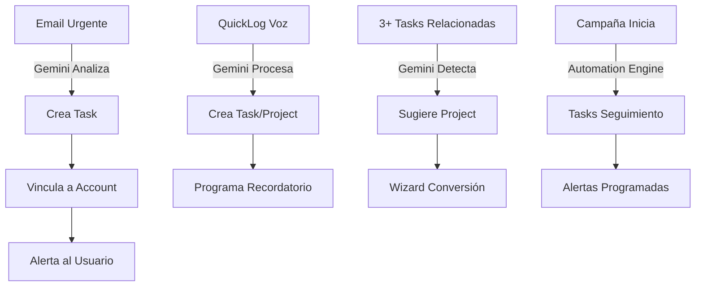

# 🎯 CONSOLIDACIÓN TASKS + PROJECTS → SISTEMA UNIFICADO GEMINI INTELLIGENCE

**Fecha inicio**: 27/10/2025  
**Objetivo**: Consolidar módulos de Tasks y Projects en un sistema integrado bajo Gemini Intelligence con vínculos directos a alertas, visitas, proyectos, campañas y eventos.

---

## 📊 ANÁLISIS COMPLETADO

### ✅ Arquitectura Actual (Fortalezas)

1. **WorkItem Interface** - Abstracción unificada existente
2. **SSOT Completo** - TaskNew & Project bien estructurados
3. **Sistema de Alertas** - Integración Gemini operativa
4. **Gemini Intelligence Hub** - Orquestador central funcionando
5. **Automation Engine** - Sistema de automatización activo

### ⚠️ Gaps Identificados

1. Servicios canónicos dispersos (no centralizados)
2. UI fragmentada sin vista unificada
3. Flujos de conversión incompletos (Alert → Task → Project)
4. Falta de analizador específico para WorkItems

---

## 🚀 PLAN DE IMPLEMENTACIÓN

### **SPRINT 1: Backend Foundation** ✅ EN PROGRESO
**Duración**: 3-4 días  
**Objetivo**: Centralizar lógica de negocio

#### Entregables:
- [x] Plan de consolidación documentado
- [ ] `src/services/canonical/task.service.ts` - CRUD + conversiones
- [ ] `src/services/canonical/project.service.ts` - CRUD + tracking
- [ ] `src/services/canonical/workitem.service.ts` - Vista unificada
- [ ] Actualizar `src/server/actions/workitems.actions.ts`

#### Funcionalidades Clave:

**task.service.ts**:
```typescript
- createTask(data, options?: { fromAlert?, fromEmail?, autoLink? })
- updateTask(id, updates)
- deleteTask(id)
- convertAlertToTask(alertId, taskData)
- linkTaskToEntity(taskId, entityType, entityId)
- getTaskTimeline(taskId)
- suggestTaskPriority(taskData) // Gemini
```

**project.service.ts**:
```typescript
- createProject(data, options?: { fromTasks? })
- updateProject(id, updates)
- deleteProject(id)
- convertTasksToProject(taskIds[], projectData)
- addMilestone(projectId, milestone)
- updateProgress(projectId)
- getProjectKPIs(projectId)
- suggestProjectResources(projectId) // Gemini
```

**workitem.service.ts**:
```typescript
- getWorkItems(filters: { type?, status?, department?, userId? })
- searchWorkItems(query: string)
- getWorkItemsByEntity(entityType, entityId)
- getWorkItemTimeline(workItemId)
- getWorkItemMetrics(filters)
- suggestRelatedWorkItems(workItemId) // Gemini
```

---

### **SPRINT 2: Gemini Integration**
**Duración**: 2-3 días  
**Objetivo**: Automatización inteligente

#### Entregables:
- [ ] `src/server/gemini/analyzers/workitem-analyzer.ts`
- [ ] Extender `automation-engine.ts` con reglas WorkItem
- [ ] Implementar flujos de conversión automática
- [ ] Testing de automatizaciones

#### Reglas de Automatización:
```typescript
1. Email urgente de cliente → Task automática (prioridad HIGH)
2. 3+ tareas relacionadas → Sugerir consolidación en Project
3. Milestone alcanzado → Alerta + Task siguiente automática
4. QuickLog "recordarme..." → Task programada
5. Campaña iniciada → Tasks de seguimiento automáticas
6. Evento próximo → Alerta 48h antes + Task preparación
```

---

### **SPRINT 3: Frontend Hub**
**Duración**: 4-5 días  
**Objetivo**: Experiencia de usuario unificada

#### Entregables:
- [ ] `src/app/(app)/work/page.tsx` - Hub principal
- [ ] `src/app/(app)/work/layout.tsx` - Layout con navegación
- [ ] `src/components/work/WorkItemCard.tsx` - Componente unificado
- [ ] `src/components/work/WorkItemDrawer.tsx` - Edición completa
- [ ] `src/components/work/WorkItemTimeline.tsx` - Historial
- [ ] `src/components/work/WorkItemLinks.tsx` - Gestión vínculos
- [ ] `src/components/work/ConversionWizard.tsx` - Task → Project
- [ ] `src/components/work/WorkKanban.tsx` - Vista Kanban
- [ ] `src/components/work/WorkTimeline.tsx` - Vista Timeline
- [ ] `src/components/work/WorkCalendar.tsx` - Vista Calendario

#### Vistas Principales:
1. **Kanban**: Columnas por estado (BACKLOG, IN_PROGRESS, DONE)
2. **Timeline**: Gantt simplificado con dependencias
3. **Calendar**: Integrado con CalendarEvent
4. **List**: Tabla con filtros avanzados

---

### **SPRINT 4: Migration & Testing**
**Duración**: 2-3 días  
**Objetivo**: Consolidar datos y validar

#### Entregables:
- [ ] `scripts/migrate-workitems-consolidation.ts`
- [ ] Validación de integridad referencial
- [ ] Tests E2E de flujos completos
- [ ] Documentación de usuario
- [ ] Guía de migración

#### Script de Migración:
```typescript
1. Auditar tasks y projects existentes
2. Normalizar campos (status, priority, dates)
3. Crear vínculos faltantes:
   - Tasks → Alerts
   - Tasks → Projects
   - Projects → Campaigns
   - Projects → Events
4. Generar WorkItem views
5. Validar integridad
6. Backup pre-migración
```

---

## 🔗 INTEGRACIÓN GEMINI INTELLIGENCE

### Flujos Automáticos Implementados:



---

## 📈 MÉTRICAS DE ÉXITO

### KPIs a Medir:
- ⏱️ **Tiempo de gestión**: -80% (de 30min/día a 6min/día)
- ✅ **Tareas completadas**: +50%
- 🎯 **Proyectos en plazo**: +40%
- 🔗 **Trazabilidad**: 100% (todo vinculado)
- 🤖 **Automatización**: 70% de tasks creadas automáticamente

---

## 🎨 DISEÑO UI/UX

### Principios:
1. **Single Source of Truth**: Un solo lugar para todo el trabajo
2. **Context-Aware**: Información relevante según contexto
3. **Quick Actions**: Máximo 2 clicks para acciones comunes
4. **Visual Hierarchy**: Prioridad clara (colores, tamaño, posición)
5. **Mobile-First**: Responsive y touch-friendly

### Paleta de Colores (Design System):
```css
--work-task: var(--sb-aqua);
--work-project: var(--sb-purple);
--work-campaign: var(--sb-orange);
--work-event: var(--sb-pink);
--work-visit: var(--sb-verde-mar);
```

---

## 📚 DOCUMENTACIÓN

### Guías a Crear:
1. **User Guide**: Cómo usar el sistema unificado
2. **Admin Guide**: Configuración de automatizaciones
3. **Developer Guide**: Extender el sistema
4. **Migration Guide**: Migrar datos legacy
5. **API Reference**: Endpoints y servicios

---

## ✅ CHECKLIST GENERAL

### Backend
- [ ] Servicios canónicos implementados
- [ ] Acciones del servidor actualizadas
- [ ] Gemini analyzer creado
- [ ] Automation rules configuradas
- [ ] Tests unitarios (>80% coverage)

### Frontend
- [ ] Hub principal `/work` creado
- [ ] Componentes unificados implementados
- [ ] Vistas (Kanban, Timeline, Calendar) funcionales
- [ ] Drawers y wizards operativos
- [ ] Responsive design validado

### Integración
- [ ] Alertas → Tasks automático
- [ ] Emails → Tasks/Projects automático
- [ ] QuickLog → Tasks automático
- [ ] Campañas → Tasks seguimiento
- [ ] Eventos → Alertas + Tasks

### Data & Testing
- [ ] Script de migración ejecutado
- [ ] Integridad referencial validada
- [ ] Tests E2E pasando
- [ ] Performance optimizado (<2s carga)
- [ ] Documentación completa

---

## 🚨 RIESGOS Y MITIGACIÓN

| Riesgo | Probabilidad | Impacto | Mitigación |
|--------|--------------|---------|------------|
| Pérdida de datos en migración | Baja | Alto | Backup completo pre-migración |
| Conflictos con código legacy | Media | Medio | Mantener compatibilidad temporal |
| Performance en queries complejos | Media | Medio | Índices Firestore optimizados |
| Resistencia al cambio (usuarios) | Alta | Bajo | Training + documentación clara |

---

## 📅 TIMELINE

```
Semana 1: Sprint 1 (Backend Foundation)
Semana 2: Sprint 2 (Gemini Integration) + Sprint 3 inicio
Semana 3: Sprint 3 (Frontend Hub) completar
Semana 4: Sprint 4 (Migration & Testing)
```

**Fecha estimada de finalización**: 24/11/2025

---

## 🎯 PRÓXIMOS PASOS INMEDIATOS

1. ✅ Crear este documento de planificación
2. ⏳ Implementar `task.service.ts`
3. ⏳ Implementar `project.service.ts`
4. ⏳ Implementar `workitem.service.ts`
5. ⏳ Actualizar `workitems.actions.ts`

---

**Estado**: 🟢 EN PROGRESO  
**Última actualización**: 27/10/2025 00:11
